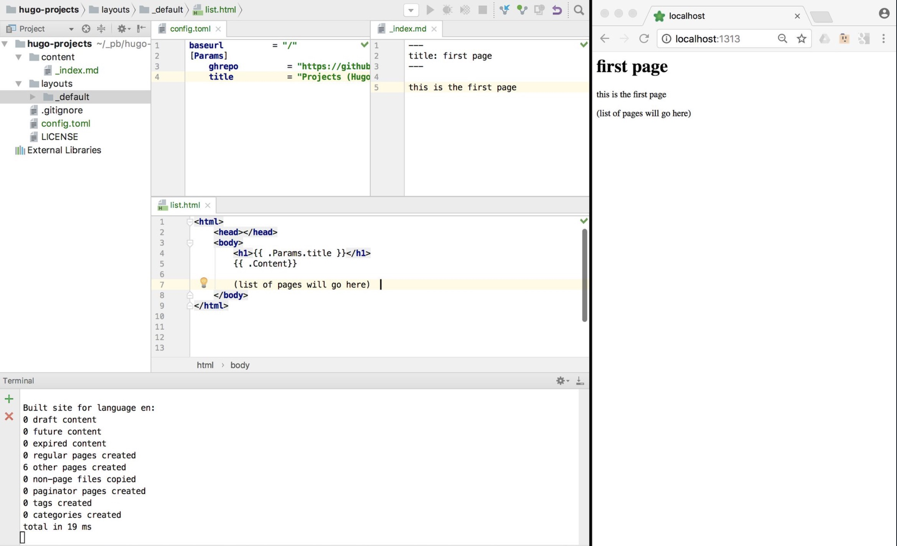
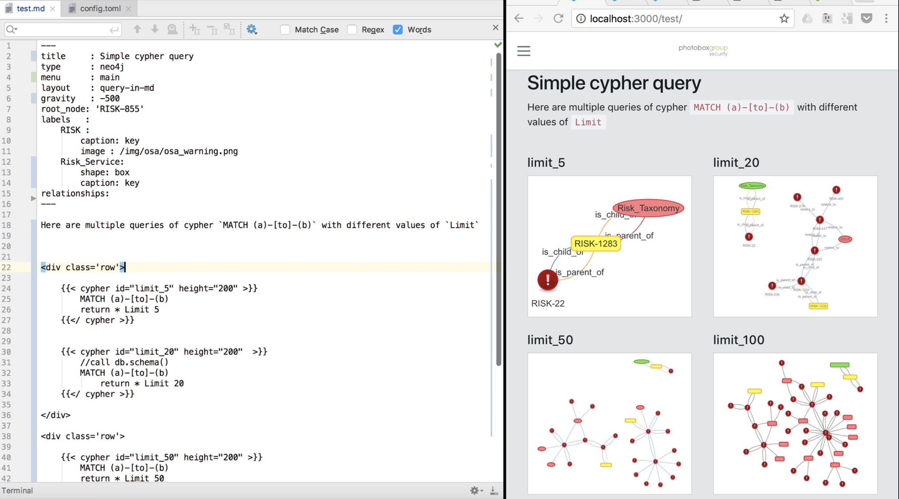
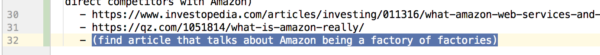
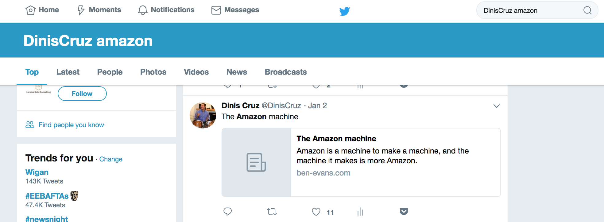

-# Generation Z Developers

    

    
        

# Introduction  
Hi Generation Z Developer, if you are and who want to learn as much as you can about your craft, this is the book for you.

I decided to write this book after doing a series of presentations to Gen Z audiences, where I discovered gaps in your generation's understanding of the history behind a number of key ideas and technologies that underpin the technological revolution that we are the in middle of. I also wanted to share a number of real-world concepts, practices and technologies that will make you a much better and effective professional in today's highly competitive tech world. 

Here is the slide that started it all, how many do you recognize?


My presentation started by me asking the audience if they recognized those logos, and then realising that not only they didn't recognized most of the logos, they didn't knew the history behind them. More importantly **why** they where created, and what was the problem (or itch) they addressed

All these icons where 'catalysts of change' and it is important to understand the history behind them, why they occured, and what happened next

Each one of these icons changed the world of technology, and the paradigms shifts that they created and still impacting our world today.

For example one of these changes/revolutions was the Creative Commons copyright license, which was one of my _'WFT you don't know what that means'_ realizations. Creative Commons gives a number of  rights to the consumer of creations. This book is released under an 'Creative Commons Attribution 4.0 International License.' license, which basically means you are free (as in freedom) to use all the materials and content from this book (only requirements are that you provide some acknowledgement of the source). You can even sell books based on content from this book.

As you will seen thorough the book, what I find interesting, is not that that a particular technology or ideas allowed X to happen. What matters to me are the ways those ideas change how we act, how we think and how we behave.

We are in the middle of a massive technological and cultural revolution and you need to decide if you want to be a pawn, a player or even a play-maker in this new world. If you don't understand the past, you are bound to not only repeat its mistakes, but you will not even understand what game is being played.

Please join me in this interesting trip down memory lane, where I will try to explain how I understand and learned from a multitude number of technologies, ideas and events.

**Be involved and contribute**

If you have never contributed to an Open Source (or Creative Commons) project, then what about using this book as your first experiments?

You can find all content for this book in [this GitHub repo](https://github.com/DinisCruz/Book_Generation_Z_Developer) and you can submit ideas and issues (you found when reading this book) [here](https://github.com/DinisCruz/Book_Generation_Z_Developer/issues)

Please share your views, suggestions and criticisms and don't hesitate to reach out to me on [@DinisCruz](https://twitter.com/DinisCruz)


        
        

            
## Generation Z             
Generation Z is the generation that was [born after 1996](https://twitter.com/PaoliCGPI/status/961121404048601088) and represents a very interesting mix of great values and digital capabilities.

The older members of this generation is about 22 years old at the moment (2018). They where 11 when the first iPhone come out (2007) and are the first real digital/online generation. They never experienced a world without internet or without google. This is the generation that is entering the market place at the moment.

In addition to having personal experience with this generation (I have two daughters aged 13 and 15), I have been involved, professionally, in a number of projects with this generation; for example teaching High School kids in the UK how to 'hack' and working with projects that aim at teaching developers coding skills usable in the real-world.

I'm focusing on this Generation because I believe they've missed the historical understanding of a number of key technology revolutions in order to be competitive in the market place.

Without a full understanding of the past, we only learn from shadows and curated versions of reality.

**I'm worried about Gen Z**

Although Gen Z have some spectacular features and values, for example they are much more tolerant and diverse than previous generations, they have a lack of intellectual curiosity that worries me.

We need to learn from the past in order not to repeat it, but lots of key technological revolutions and paradigm shifts seem to be not understood by Gen Z.

They are in an age when information and knowledge is a click or google search away. Yet in conversation after conversation with Gen Z teenagers I've found that they have a very thin understanding of the history of particular technologies, why they occurred in the first place and what problems the technology tried to solve.

My hope with this book is to break through those gaps and provide context and references, so that better informed decisions can be made by members of this generation. They afterall will need to save the world from the mess the previous generations are creating.

**Overwhelming curiosity**

What I hope to provide is a couple moments where you get this overwhelming curiosity to just learn more about topic, where you start to follow link after link about a particular topic, and that you get a number of 'WOW, that is fr**** awesome!' moments.

If you are lucky enough to find yourself in this place, congratulations, you just found 'the zone'. An amazing enviroment when you are single minded and 100% focused learning, which is the best way to learn.

Whenever you find yourself in this headspace, dont stop! Follow it as long as your brain allows it, and don't stop for anything, namely social events, eat or sleep (as long as you respect your physical and mental health). This 'zone' is a magical place to be , so learn to recognize when you are inside it and explore it as much as you can.


            
        

            
## How to get a job             
One of my objectives with his book is to help you to find a great job. One that you will love to go everyday, one where you are in a steep learning curve and one that aligns what you passionate about with what your employer is happy to pay for.

It is very important to realise that if you are in an job (or school) where your learning curve is not off-the-charts, you are short-changing your life and your career. Nobody cares as much about your carer as you do, and you are the only one that has full control over your attitude to learning. You can chose everyday on how engaged and receptive you are to learn and to help others to help you learn. It is not exaggeration to say that you decide your future's direction and path with every decision you make.

There is a lot of competition out there and if you look at what is coming next, namely AI and the next billions of internet users, you need to maximise your changes and opportunities.

I really like the Gen Z realization that a job is something that should be rewarding and not just a way to make money. After all the best job is when you are paid to do something that you would do for free. Although I am very fortunate to be in that situation, where I love my job and what I do every day, it didn't happened by accident. I made a number of key decisions in my life, some with very short-term negative implications, that allowed me to align what I love to do with what the market wants to pay.

**Being passionate and love your job**

Find what you are passionate for, what you really care about, and align your career with those ideas. The best part is that this is a massive win-win situation, since the more passionate you are about a particular topic, the more you care about it, and the more valuable you are to the company that is employing you.

**Having one competitive advantage**

The best way to get a job is to have ONE competitive advantage. One activity or task that you can do better than the person or company hiring you. For example in the 1990s for a lot of companies it was simply that you could use a computer! In the 2000s is was using the Internet. In the early days of software development or security, all it took was good programming or hacking experience. Although it might look that the bar was lower those days, the reality is that those who could do it were the ones who proactively embraced the technologies and learned them against all odds. Individuals can become experts at new technology faster than the tech companies. You can be first in line for a job when they need that expertise. These days, it is technologies like: ML/AI, Graphs, Chaos Engineering, GitHub, Git, Jira, Creative Commons, Continuous Integration, AWS, WallabyJs and the other ideas covered in this book :)

**Own your career development**

You are the one in change of your career. Yes, listen to advice but only you can ultimately choose which paths to follow. You need to discover those paths by yourself, via trial and error, and a great way to do that is to work for companies who are aligned with those paths.

And how do you start working with those companies?

Easy, start collaborating on their Open Source projects. Act like you are part of the company. Understand their values, and behave in ways that that add value to that company, namely the tech stack.

Start by approaching the key individuals and developers from those companies and communities, offline and online, in a way that adds value to them. Build relationships that will teach you a lot, and potentially lead to very interesting job offers, or at least references. Start learning how to add value and how to become good at proactively solving problems, which is one of the most valuable assets you can bring to a company.

What's interesting is that there is nothing stopping you from doing this! We are in very open, collaborative and creative times. You have nothing to lose by giving it all you've got, and all to gain.


            
        

            
## How this book is being created             
This book is being created using the principles and technologies described in this book :)

 - All content is available under an CC License (Creative Commons)
 - Markdown is used to write the content
 - All content is managed using git and published under an public GitHub repository
 - GitHub Issues are used to track bugs, issues and ideas 
 - Leanpub is used to create and publish the digital versions of this book
 - Content is being published early and often on Leanpub and on some blogs (to share the ideas, get feedback and build community) 

 If you have never used git, github or markdown, why don't you help out in the creation of this book? You can do this by opening up issues with your feedback on the ideas and content (I really value those comments since it helps me to make sure the content makes sense to the target audience)

            
        
    

    

    
        

# MVP for Gen Z Dev  
This section will try to define what should be the MVP for a Generation Z Developer.

MVP is a term used regularly in the software development industry to mean [Minimum Viable Product](https://en.wikipedia.org/wiki/Minimum_viable_product), and it represents the minimum set of features and capabilities that a particular product/release/version should have in order to add value to the end users/customers.

From a Gen Z Dev point of view (i.e. you the reader), the technologies and workflows described in this section are key to make you highly productive and effective team player.

Although you might not use them all in your day-to-day activities, it is very important to understand what they are and why they where created in the first place.

In this section I will try to give you ideas on practical steps you can take, and here is first one:

> TASK: Write blog posts with your experiments and challenges in understanding and using these ideas, technologies or workflows.

Drop me a link to these posts so that you have at least one reader :)

Note: Best way to do it is via a twitter mention (i.e. tweet with a link to the article and my twitter handle tag `@DinisCruz`)

        
        

            
### MVP Table 

| name | what | task | price |
|------|------|------|-------|        
|  Creative Commons | Copyright License to release content under | Release a blog post or other content under a CC license | zero |        
|  Open Source | Copyright License to release software that guarantees a number of freedoms | Release some code under an Open Source license | zero |        
|  Docker | Containerization technology that is super fast at applications or micro-services execution | Install docker and try the ubuntu, apache, elk and gogs images | free |        
|  Jira | Web based issue tracking system (can be used as Graph Database) | Create an free account at atlassian.com and try it out | 0 to you |        
|  OWASP | Worldwide community focused on Application Security | Attend a chapter meeting and contribute to an project | free |        
|  Python | Programming language that all developers should master | Create and publish an Python tool | free |        
|  Slack and ChatOps | Communication and decision making platform | Create Slack Workspace and write a Slack bot integration | free |        
|  Hugo | static site generator and major paradigm shift on how to think about websites creation and deployment | install hugo, create a website and publish it (ideally using AWS S3) | zero (hosting might have some costs) |        
|  Xcode and Swift | Development environment to create iPhone of Mac applications | Install Xcode and create your first Mac Application | Xcode requires a Mac (bought or rented) |            
|  TDD (Test-Driven Development) |  |  |  |            
|  AWS |  |  |  |            
|  Continuous Integration |  |  |  |            
|  Dot Language |  |  |  |            
|  Electron |  |  |  |            
|  GitHub Flow |  |  |  |            
|  IOT (Internet of Things) |  |  |  |            
|  Wallaby and NCrunch | Unit Testing execution add-ons that will change how you write and debug code | Install the evaluation version are give it a good test drive | Free eval for 30 days, $100 USD for personal license |            
|  google |  |  |  |            
|  linux |  |  |  |            
|  raspberry-pi |  |  |  |

            
        

            
## Creative Commons             
Choosing which license you chose to share your work is one of the most important decisions you make in your professional life.

You can either go down a path where you think that everything you create (outside paid work) is super precious and you need to protect it or you can realise that your value is on your ability to think about ideas, and (more importantly) your ability to execute those ideas.

In the first path you are afraid that your ideas will be copied and you don't share them, on the 2nd path you are happy to share your ideas as much as possible. 

The best way to share your ideas and way of thinking is to release your content and ideas under an Create Commons Copyright License 

**So what is Create Commons?**

Let's start by looking at the definition of [Creative Commons](https://en.wikipedia.org/wiki/Creative_Commons) from Wikipedia:

> A Creative Commons (CC) license is one of several public copyright licenses that enable the free distribution of an otherwise copyrighted work. A CC license is used when an author wants to give people the right to share, use, and build upon a work that they have created. CC provides an author flexibility (for example, they might choose to allow only non-commercial uses of their own work) and protects the people who use or redistribute an author's work from concerns of copyright infringement as long as they abide by the conditions that are specified in the license by which the author distributes the work

This license is basically defining the rules of the game that are applied to the content that you publish. By releasing your content under this license (and your code under Open Source) you are sending a strong message of your values and positioning. You are also maximizing the potential reach and impact of your ideas. Like Steve Jobs said in his [Stanford Commencement address](https://news.stanford.edu/2005/06/14/jobs-061505/) in 2005 _"...you can’t connect the dots looking forward; you can only connect them looking backward. So you have to trust that the dots will somehow connect in your future..."_ , you could be generating a number of opportunities for your future self, or you could even be teaching something to your future self (it's amazing how much we forget)

### Creative Commons license variations and this book

This book is released under the [Creative Commons Attribution 4.0 International (CC BY 4.0)](https://creativecommons.org/licenses/by/4.0/deed.en_US) which defines the following terms (see website):

> You are free to:
>
> - Share — copy and redistribute the material in any medium or format
> - Adapt — remix, transform, and build upon the material for any purpose, even commercially.
>
> Under the following terms:
>  - Attribution — You must give appropriate credit, provide a link to the license, and indicate if changes were made. You may do so in any reasonable manner, but not in any way that suggests the licensor endorses you or your use.
>
> The licensor cannot revoke these freedoms as long as you follow the license terms.
>
> No additional restrictions — You may not apply legal terms or technological measures that legally restrict others from doing anything the license permits.

Although all CC licenses allow content to be shared, some have more restrictions:
 
 - **Attribution-ShareAlike 4.0** - need to attribute and use the same CC license (this has a 'viral' effect since it forces changes to also have a CC license)
 - **Attribution-NoDerivatives 4.0** - need to attribute and don't allow changes
 - **Attribution-NonCommercial-NoDerivatives 4.0** -  need to attribute, don't allow commercial use and don't allow changes 
 
 I don't like the licenses above since they put restrictions on how the content can be used (which is against my views of sharing, but for companies or individuals that are new to CC, these are good first steps.

 For reference here is a table with the multiple license's variations:

 [](https://en.wikipedia.org/wiki/Creative_Commons_license)


### Obscurity is your biggest threat

 Tim O'Reilly on [Piracy is Progressive Taxation, and Other Thoughts on the Evolution of Online Distribution](http://www.openp2p.com/pub/a/p2p/2002/12/11/piracy.html) provides this amazing quite: _'For a typical author, obscurity is a far greater threat than piracy.'_. 

 What this means is that you have more to lose by not publishing your ideas, music, or art. 

### Creative Commons is changing science

 Ironically, most modern science was built on the idea of sharing ideas, cross-verification and healthy challenges of assumptions/theories. But for a while, science (due to a number of reasons) started to become a closed world, with large amounts of information and data only being available to a selected 
 
 Good news is that in the last decade this has started to change. I think a big part of it was caused by the cross fertilization of practices brought to science by developers who were exposed to the Open Source workflow (and culture and effectiveness) and help to push for a much more open and collaborative environment between teams. See for example the collaboration of code and data-sets that is happening on areas like cancer research

 Also amazing is the massive amount of data that is being shared today by government's agencies. See these books for amazing info-graphics created from this data:

 - [Information is Beautiful](https://www.amazon.co.uk/Information-Beautiful-New-David-McCandless/dp/0007492898)
 - [Visualize This: The FlowingData Guide to Design, Visualization, and Statistics](https://www.amazon.co.uk/Visualize-This-FlowingData-Visualization-Statistics/dp/0470944889)
 - [Knowledge is Beautiful ](https://www.amazon.co.uk/Knowledge-Beautiful-David-McCandless/dp/0007427921)

See the https://data.gov.uk/ website for data-sets provided by the Uk Government (released under the [Open Government Licence](http://www.nationalarchives.gov.uk/doc/open-government-licence/version/3/) which is compatible with Creative Commons Attribution License 4.0 )

It is key that you learn how to play in this world where massive amounts of data are available, since, more and more there is an moral and technical argument that all data created by government should be released under an creative commons license, and all code paid by the government should be released under an open source license. Think about the implications that this will have on industries and professions that rely of data to make decisions.

### The importance of creating commercially viable models

Note that this doesn't mean that there should no financial return (ever) from sharing your ideas or content.

I'm a big believer that for behaviors to scale and be sustainable, there needs to be an working economic and financial model behind those open workflows.

Basically authors should be paid for their work 

Also key is that the operational teams that support those authors are also paid (for example Wikipedia or Mozilla have highly skilled and well paid professionals working as employees). 

Sometimes the payment is hard cash (i.e. the authors/teams are paid to create that content).  Sometimes the 'payment' happens in terms of: future opportunities, personal development or karma points (i.e. doing the right thing or sharing knowledge with others the same way it was shared with you).

One of the big myths behind open source and creative commons is that its authors are all working for free in their bedroom by amateurs. In reality most of the value is created during paid jobs, by highly skilled professionals, with companies supporting the creating of the released code or content.

### It is harder than it looks

Don't let the fact that you (might) think that what you have created has little value to prevent you from publishing it. This Impostor Syndrome effect can be very damaging and paralyzing, and you need to take a pragmatic view of what will happen

 - If what you wrote is not that interesting or valuable to others, then your will have a small amount of readers and you have not lost anything
 - If what you have created does get some readers and more importantly, feedback or comments, then you gained a bit and moved the needle a little bit (remember that it is all about incremental gains, and there is no such thing as 'overnight success')

The bottom line is that publishing your research under an CC license is harder than it looks. 

You actually have to do it, and that first step (and the next 100) are the hardest part

Doing that journey under an Creative Commons path, means that you have made the paradigm shift from close to open It means that you now view your value as someone who can execute ideas (and are happy to share your creations)

Remember that anybody can have ideas, execution is the hard part.    

### Align your future with Creative Commons

Finally, when choosing which company to work for, take into account their current Creative Commons and Open Source strategy culture for internally developed technology ideas (this should have an impact on your choices.

In most companies, only a very small part of what they create should be closed and proprietary. The rest should released under open licenses. 

Remember that these days (specially in technology) you will be changing jobs and companies regularly. Your really want to make sure that you still have access to those ideas and code when you move of, since nothing is more soul-destroying than having to re-do something you have already created before (or not having access to good ideas you had in the past).


            
        

            
## Open Source             
The first thing to learn about [Open Source](https://opensource.org/) is that it is not just a licence to release software or a way to get code for free (as in no cost). 

Open Source is a way of thinking about code and applications, in a way that there isn't an explicit 'lock-in' on the user by the creator. When code is released under an Open Source license, the consumer of that code (namely the developer) gains a number of very important freedoms which have been proven to create very effective and powerful development environments.

You use Open Source applications and code everyday, can you name them? 

There is nothing you can do today on the Internet that doesn't touch some Open Source code, and the amount of code that is currently available to you under an Open Source is insane.

An Open Source licence is a copyright license that gives you the right to access, modify and distribute source code. This is a variation of what has been called an [Copyleft](https://en.wikipedia.org/wiki/Copyleft) license. Copyleft is actually an Copyright license based on the idea of giving away rights to the user, instead of the most common use of Copyright, which takes right's away.

### Think and behave in an Open Source way

As with the Creative Commons license, Open Source is a way of thinking and behaving about code. 

You has a developer should be releasing everything you do with an Open Source license. This will make sure that your 'future self' can still access that code, while maximizing the potential usage and exposure of that code.

You should also be an active contributor to Open Source projects! 

Not only you will learn a lot, that participation can really help you in finding a job. 

If you are able to get your code changes approved and merged into the code-based of popular Open Source projects, you show the world the quality of your work and communication skills. I can guarantee to you that adding to your CV mentions of these contributions will immediately give you a lot of respect by your peers and interviewees. In fact a great way to get a job in a company is to contribute to an Open Source project hosted by that company.

### Who uses Open Source


As you can see from the image above just about everybody is using Open Source these days, on all sorts of industries and use cases. Even Microsoft who used to call [Open Source a cancer](https://web.archive.org/web/20011108013601/http://www.suntimes.com/output/tech/cst-fin-micro01.html), eventually changed paradigm and now claims to ['love linux'](https://cloudblogs.microsoft.com/windowsserver/2015/05/06/microsoft-loves-linux/) and has recently bought [GitHub](https://blogs.microsoft.com/blog/2018/06/04/microsoft-github-empowering-developers/).

### History

Open Source is an idea created 20 years ago (in a meeting on February 3rd, 1998) with a number of heavy weights of the Free Software movement, who had the objective to create a common language and framework (and license) to be used by the community. 

This lead to the creation of the [Open Source Initiative](https://opensource.org/) who approves multiple community created [Open Source Licenses](https://en.wikipedia.org/wiki/Open-source_license). 

One of the challenges that the Open Source license tried to address, was the more aggressive and viral nature of the [GPL](https://en.wikipedia.org/wiki/GNU_General_Public_License) (General Public License). GPL requires that the developer's release under the same GPL license, all code that uses or modifies the original GPL code. 

Basically, once you add some GPL code to you app, you also need to release that app under GPL. In practice this proved to be to restrictive to the adoption of lots of libraries and applications. Even worse, that limitation went against what most Open Source creators want, which is the wide and seamless use of their code

Here is an definition of [Open Source software](https://en.wikipedia.org/wiki/Open-source_software) from Wikipedia:

> _Open-source software (OSS) is a type of computer software whose source code is released under a license in which the copyright holder grants users the rights to study, change, and distribute the software to anyone and for any purpose. Open-source software may be developed in a collaborative public manner_

If you look at the arc of history, there is a tendency for code to be open, even when there are massive forces that don't want that (i.e. the companies selling proprietary/closed-source software). 

In addition to efficiency, innovation, reduced lock-in and better collaboration, Security is one of the reasons we need the code to be open. 

At least when code is open and available, we have the ability to check what is going on, and be much more effective when reviewing its security (see [Reflections on Trusting Trust](https://www.ece.cmu.edu/~ganger/712.fall02/papers/p761-thompson.pdf) for more on trust chains). 

Note that this doesn't mean that Open Source software is auto-magically secure just by being Open Source (we still need an ecosystem that rewards or pays for security reviews and secure development practices) 

Another major evolution in the history of open source was its effect on companies like Google and Facebook, where Open Source applications and code where a major contributor to their scalability and success. 

### Open source business models

It is amazing to see the change in the industry and thinking around Open Source. In early days of Open Source, me and many others were called 'communists', just by defending that code and ideas should be shared and made free.

These days there are tons of business models that have been proven to work on top of an Open Source models. For example here are [12 examples](http://www.openhealthnews.com/articles/2012/open-source-business-models-more-depth-view) :
 
 - Software Support Business Model, Software Services Business Model, Software as a Service (SaaS) Model
 - AdWare Business Model
 - Consulting Services, Independent Contractors/Developers, Indirect Services & Accessories
 - Proprietary Software Model, Premium Software Model, Dual Licensing Model, Hybrid Model, Public Domain Model
 - Platform Integration Services, Hardware Integration Model
 - Non-Profit Business Models 
 - Defensive Business Model/Strategy

For Open Source to scale and be sustainable in the long term, it has to be supported by an viable economic model (one where there is a positive feedback loop of value for its creators and maintainers). These examples of Open Source business models (and the successful companies/services that use them) are behind a significant number of the open source contributions that we see today. Of course that there are other forms of receiving value form contributing to Open Source, namely learning something new, contributor brand enhancement or even just purely the joy we get from sharing knowledge.

In a weird way, the Open Source revolution has happened, most of the key battles have been won, but a large number of Gen Z are not aware of it (and are not poised to benefit from these business models and strategies). The danger is that there is still a lot of to do in the Open Source world and we need the Gen Z to be a big driver and innovator. 


### Releasing code under an Open Source license

Question: 'Why don't you open source your code?'. I bet the answer is a combination of:

 - "I don't think my code is good enough"
 - "I'm embarrassed about my code"
 - "Nobody will want to use my code"

The first thing to understand is that I have heard these same excuses from all sorts of developers and companies, for code in all sorts of quality and completeness.

This is your [Lizard brain](https://facilethings.com/blog/en/lizard-brain) in action (making excuses of why you shouldn't do something)

The key is to just do it! 

Create a GitHub or BitBucket repo, add the license and start building your community.

So how do you Open Source some code?

 1. Create a repo and add code to it
 2. Add file containing an Open Source license
 3. That's it!

And then, after you Open Sourced your app or code, what will happen next is: Nothing!

The reality is that it is very hard to create a community around an open source project (most open source projects have been created and are maintained by a very small number of developers)

What you will have done by adding the license file to your code, is to create future opportunities for that code and sent a strong message about your agenda (i.e. you are not going to lock in the future the users that are using your current code today):

 - you are allowing somebody (which could be you) in the future to use your code
 - you are also protecting your research, so that if you move companies, you can still use that code (there is nothing worse for a programmer than to having to rewrite something that was working ok (specially when it is a framework that supports a particular workflow)

I believe that we have moral imperative to share our ideas.  I don't want to be the one that close ideas and don't let other benefit and learn from them. These days everything you do is a variation of what somebody has done before (i.e. you are adding an incremental change), after all you are sitting in shoulders of the giants that come before you.  

### Open Source as a way for companies to collaborate and find talent    

There has been big success stories of companies collaborating internally externally (i.e. internal collaboration between different teams via open source code)

Ironically, although most developers have internal access to all code, the number of cross-team pull requests is very low. Publishing the same code under an Open Source license will help a lot in its internal reach, usage and collaboration.

This also means that by allowing others to use their code, cleaver companies are creating a great way to find programmers to hire (or companies to buy). As a developer you should take advantage of this and be an active contributor on the open source projects of the companies you want to work for (this is a great way to meet the key developers from those organizations, which might turn up to be key decision makers in your job application)

### Open Source as a way to define the agenda

When I see code (or applications) that are not released under an Open Source license, namely the scenarios when the application is provided for 'free; (as in zero cost, not as in freedom), I always think 'What is their agenda?', 'Why are they not Open Sourcing the code?', 'Is this a plan to hook the users, make the dependent on the technology and then start charging at a later stage?'.

When the companies (or authors) release code under an Open Source license they allow their users to have the ability (if they want) to control their own destiny. 

Although hard to quantify, I have seen lots of examples where much better engineering decisions have been made due to the fact that ability to lock the user in restrictive licenses is not there.


### The Cathedral and the Bazaar

As with many others, my paradigm shift into an Open Source mindset happened 20 years ago after I read the [The Cathedral and the Bazaar](https://en.wikipedia.org/wiki/The_Cathedral_and_the_Bazaar) essay and book, where Eric Raymond provides 19 lessons which are still as relevant today (2018) as when they were published (1998). 

Here are some of the best ones:

 - Every good work of software starts by scratching a developer's personal itch.
 - Good programmers know what to write. Great ones know what to rewrite (and reuse).          
 - Release early. Release often. And listen to your customers.
 - Given a large enough beta-tester and co-developer base, almost every problem will be characterized quickly and the fix obvious to someone. 
 - If you treat your beta-testers as if they're your most valuable resource, they will respond by becoming your most valuable resource.
 - To solve an interesting problem, start by finding a problem that is interesting to you.

In the book Eric compares the creation of proprietary applications to an Cathedral and the development of open source to an Bazaar. 

In Eric's view, Cathedrals are: massive and expensive undertakings, take ages to create, don't have much innovation (apart from a couple major areas), have all sorts of top-down management problems, are super expensive , don't usually work very well (for the intended purposes) and don't usually turn up the way they were originally designed.

On the other hand the Bazaars behave like living organisms, always innovating and with always somebody somewhere trying something new.

I actually prefer to see the beauty in both Cathedrals and Bazaars. Each has it magic and situations when they are exactly what is required.

What I find interesting about this analogy, is that with the understanding that we now have of developing software in ways that are super-effective, that promote continuous refactoring and that are constantly deploying one small/medium change at the time (which is what we get from effective TDD and DevOps environments), we can actually 'build amazing Cathedrals out of Bazaar' (i.e. create an Cathedrals by continuously refactor and improve what started has an Bazaar). 

This goes to the heart of what I have noticed in effective development environments with crazy-high code coverage: 'the more code and capabilities are added to the application, the faster changes can be made' (which is the opposite of what happens in a lot of projects, where the higher the quantity of code, the slower everything becomes).


            
        

            
## Docker             
As a developer it is critical that you understand how docker works and how it became so successful and widely used. Docker is one of those revolutions that occur regularly in the IT industry where the right product comes at the right time and meets a number of very specific pain points that developers have.

From a practical point of view, docker means that it is very easy for you to easily try and use a wide variety of applications and environments. For example you can start a local (fully working instance) of the [ELK Stack](https://www.elastic.co/elk-stack) (Elastic search + Logstash + Kibana) in docker, simply by running the `sudo docker pull sebp/elk` command (without installing anything on your host machine)

The first time I saw and used docker, I was massively impressed by its simplicity and its potential to change how not only applications are deployed, but how applications are developed.

To understand Docker and its power, the first concept to master is how docker is a _"process that exposes a multi-layered file system as an fully isolated OS"_

It is easy to see Docker as just a faster VM environment or a faster Vagrant (which is a way to programmatically create VMs). I've seen companies that because they had automated VM deployments to such an extent (i.e. they become really good at automating the creation and deployment of multi-gigabyte VMs) they dismissed Docker as just another IT fad.

The problem is that Docker is much more than just a faster VM, and By fast, I mean super-fast. normal VMs boot in minutes, Docker can give you a fully working Ubuntu box with Node installed in sub second start time (just run `docker run -it node bash` and when inside the docker container run `node -e 'console.log(20+22)'`).

Docker starts in second(s) because it is just a process. The magic sauce is created by:

1. a number of linux kernel technologies that are able create a sandboxed environment for that process (for files and network access and other key parts of the OS)
2. a layered file system, where each layer contains a diff with the previous layer. This is a powerful graph db, where each file location is dynamically calculated when you are inside the docker image. Basically what is happening is that each layer is immutable, and when a file is changed inside docker it is either a) saved as new docker image or b) lost when the docker image stops. An final 'docker image' is just a collection of multiple images, all stacked up, one of top of the other. 
 

### Kubernetes

Once you want to:

1. use multiple docker images in parallel (for example an image for the web server, an image for file system and an image with a database) or 

2. start multiple images at the same time (for example a web server behind an load balancer) 

you will need to start looking at what is called orchestration technologies.

The docker team has published a light version of orchestration called [Docker Compose](https://docs.docker.com/compose/) and [Docker Swarm](https://docs.docker.com/engine/swarm/), but what is widely used in the production is [Kubernetes](https://en.wikipedia.org/wiki/Kubernetes)

Kubernetes (sometimes also called K8) was actually developed by Google and was inspired by [Google's Borg](https://ai.google/research/pubs/pub43438). The Borg is one of the key reasons why Google was able to scale massively in its web search and in services like GMail. Everything at Google is a container and as early as 2014 Google claimed to start [two billion](https://www.theregister.co.uk/2014/05/23/google_containerization_two_billion/) [containers per week](https://cloud.google.com/containers/)

The problem that Kubernetes solves is the codification of an application environment, plus its deployment strategy and its scalably requirements. 

This is very powerful, since it allows you to basically say: _"I want x number of pods (i.e. web servers and database) to always be available, and if they stop, make sure they are restarted (and configured accordingly)"_

The reason why is so important to understand this is because you need to evolve from: creating environments by clicking on a lot of of things, to: codifying your server environment (which is just a higher level of programming abstraction layer). 

Note that you also get a similar workflow with tools like [AWS CloudFormation](https://aws.amazon.com/cloudformation/) 

One easy way to give Kubernetes a test drive is to use [AWS EKS](https://aws.amazon.com/eks/)

### Security advantages

From a security point of view, Docker has massive advantages. 

The first is an explicit mapping of what needs to be installed and what resources (for example ports) need to be made available.

Docker also makes possible to safely run 3rd party code in isolated (i.e. sandboxed) environments, where any malicious code running inside those docker containers, would not have access to the current host user's data. This is actually the future of desktop and server-side apps. where easy external (or even missing critical) service/code is executed inside containers.

### Testing and visualizing Docker

One area where we are still quite immature (as an industry) is the testing of Docker images and Kubernetes setups.

There isn't good tools, IDEs and Test Runners for docker and kubernetes. Basically we need a TDD workflow for docker development!

If I was you, this would definitely be an area I would focus my research (while blogging about your efforts). 

Another great research area is the visualization and mapping of kubernetes environment (i.e. who is speaking to who, and how is that traffic authentication and authorized)

You would have big competitive advantage in the market place if you understood these concepts and had practical experience at solving them.

### It all stated with physical containers

For a great introduction to Containers see MAYA Design's [Containerization](https://vimeo.com/49392667) animation, and the Wendover Productions' [Containerization: The Most Influential Invention That You've Never Heard Of](https://www.youtube.com/watch?v=F-ZskaqBshs) video

To see what is coming next see MAYA Design's [Trillions](https://vimeo.com/7395079) - video and the [Trillions: Thriving in the Emerging Information Ecology](https://www.amazon.co.uk/Trillions-Thriving-Emerging-Information-Ecology/dp/1118176073) book

            
        

            
## Jira             
[Jira](https://www.atlassian.com/software/jira) is a web application that is widely used by development, engineering and technical teams to manage their day to day tasks and activities.

There is massive worldwide adoption by all types of companies, and we (at Photobox Group Security) use Jira extensively in our day-to-day. We use it for example to manage: vulnerabilities, risks, task management, incident handling, OKRs management, asset register, threat modeling, data journeys and even to create an pseudo org chart for the stakeholders of risks. 

To make this work we are very advanced users of Jira, where we create tons of custom Workflows and even write custom applications that consume Jira's APIs.

We basically use Jira as an graph database and [Confluence](https://www.atlassian.com/software/confluence) as a way to display the information stored in JIRA. See the [Creating a Graph Based Security Organization](https://www.slideshare.net/DinisCruz/creating-a-graph-based-security-organisation-devseccon-keynote-81345667) presentation for more ideas on how we do this.

The key point I want to make here is: in order to make the tools that we use in the enterprise work, they need to be customized and extended. 

Being able to write these customization's and understanding at a much deeper level what is possible with these tools (when compared to 'normal' or 'power' users), is a massive competitive advantage. Customizing and extending tools should not be seen as an exception, it should be the rule. 

The reason this scales is due to the compound effect (i.e. increased returns) of the features implemented. The changes/features we make today, will make us more productive tomorrow, which will help us to make more changes, which make us even more productive.

In fact as a developer, if you are able to write custom JIRA workflows that are usable by your team, that will be a massive competitive advantage for you, and it will make you highly employable today.

### Reality is the one that is complex

It is important to note that once the complexities and interconnections of reality start to be mapped in Jira, it can be very overwhelming. 

For example we use Jira heavily in our incident handling process, where we can easily create 100+ issues during an incident, with each issue being a relevant question or action to be answers or executed during the incident. It is easy to look at that setup and think that it is too complex and a massive bureaucracy. But in reality that combination of issues (of type: Incident, Task, Vulnerability and Epics) represent an accurate representation of the complex reality and massive amount of information that is created during an incident (the alternative are completely unmanageable and unreadable email, slack threads or word docs). 

All the work comes together via powerful up-to-date  Confluence pages (which we convert to PDFs and distribute via slack/email) that answer the key questions of: 'What has happened?', 'What are the facts?', 'What are the hypothesis we are exploring?', 'What is happening now?' and 'What are the next steps?'. This is how we keep everybody involved in sync, and how we provide regular management updates.

The other massive advantages of this setup, is that it allows us to do very effective post-incident analysis and to create playbooks with predefined tasks to be executed when a similar incident occurs in the future. Basically our playbooks are not a word document with tasks and actions, our playbooks are a lists of Jira Tasks that are used to populate the incident set of tasks.

For more ideas about this topic see the [SecDevOps Risk Workflow](https://leanpub.com/secdevops/) book that I'm also writing and the [SecDevOps Risk Workflow - v0.6](https://www.slideshare.net/DinisCruz/secdevops-risk-workflow-v06) presentation .


### Use Jira in your life

Create Jira projects for your life activities (with Epics to track group of tasks)

Create a Kanban board for your personal tasks and Epics.

Create custom workflows and learn how to manage Jira. This will give you tons of confidence when using Jira in the real world (or when intervening)

And since Atlassian has evaluation version for their cloud version of Jira, there isn't any cost to try this. You have no excuse to not having used Jira before (at a level more advanced that most corporate users and the developers interviewing you)

### What makes Jira so powerful

Although Jira has tons of really annoying features and bugs, its feature set is very powerful, and with finely tunned process and customization's it will make the difference on your productivity and will change how you work.

Here are some the really powerful features that Jira has:
 
 - **Issues** - that can be easily linked to each other (i.e. nodes and edges)
 - **Links** - which can be named, and allow the creation of named edges, for example 'RISK-111 is-created-by VULN-222'
 - **Workflows** - state machine environment where the issue's status can be visually mapped and powerful buttons be created, for example for status transitions like 'Accept Risk'
 - **Activity logging** - ability to log every change and status transition
 - **Labels** - ability to apply all sorts of loosely created labels/tags to issues (we use this to help managing specific workflows, for example by adding the 'Needs_Risk_Mapping' label to an issue)
 - **Components** - ability to map issues to components which map directly into business' areas or applications
 - **Kanban boards** - powerful way to view the current tasks and what status they are
 - **Dashboards** - ability to create all sorts of diagrams and tables from Jira data (although we tend to use Confluence for data visualization)

### Its all about People, Process and Technology

In order to create a successful Jira environment (the 'Technology' part) we have to start with the 'People' part (in this case you). It is the mindset of the individual user that helps to kickstart these workflows.

The other key element to make this work is the 'Process' of how things work. What I found is that it is very hard for participants to really 'get' these processes and to really understand at a deeper level how the hyperlinked graph-based architecture works. By nature there will be a lot of changes, not only of past workflows, but of existing workflows (i.e. change is the only constant)

Ironically this means that Jira is not key to make this work. 

I have built similar systems using GitHub.

Although GitHub doesn't have some of the most advanced features of Jira (like workflows), the fact that GitHub has native Markdown support, that all content is managed using git and that it is super fast, makes it also an effective graph database.

With the right People and Process, lots of technologies can be used to make this work. As long as they can be used a Graph Database with every piece of data being available in an hyperlinkable way

            
        

            
## OWASP             
[OWASP](https://www.owasp.org/) (the Open Web Application Security Project) is a worldwide organization focused on Application Security. We are the good guys that are trying to make the world a safer place :)

I have been heavily involved in OWASP for a long time, and it is one of the more open, friendly, knowledgeable and carer-enhancing communities you can find. I've meet some of my best friends in the industry though OWASP and what I've learned from its projects and events is too long to list here :) 

There are many ways that actively participating in OWASP will make you a better developer and enhance your carer. Part of building your brand, skills and network is the participation in Open Source communities, and OWASP is a a perfect place to do that.

The first place to start is your local Owasp Chapter. With [100s of chapters](https://www.owasp.org/index.php/OWASP_Chapter) worldwide, you shouldn't be to far from one (if not then [start one](https://www.tfaforms.com/261541), the London Chapter started many years ago over beers in a London pub). Attend a chapter meeting, learn something new and create connections.

Next step is to check out the [OWASP projects](https://www.owasp.org/index.php/Category:OWASP_Project#tab=Project_Inventory) and see which ones are relevant to your current work/research, and more importantly, which ones you should be involved as a contributor. Most OWASP projects, even the bigger and most successful ones, are usually maintained by only a couple individuals, and ALL projects are desperate for contributors and help! It is not that hard to start, just fork the project in GitHub, see the open issues and start sending the Pull Requests.

Check out the main [OWASP Conferences](https://www.owasp.org/index.php/Category:OWASP_AppSec_Conference) and events like the [Open Security Summit](https://open-security-summit.org/) which are amazing places to learn and meet highly talented professionals, all happy to share knowledge and teach.

Finally, join up [OWASP Slack](http://owaspslack.com) where you will find everybody and 100s of channels dedicated to everything OWASP related (projects, chapters, conferences, topics)

### Find jobs via OWASP contributions

Due to its open nature and focus on finding solutions for hard problems (related to application security), OWASP's community is made by the 'doers', i.e. the ones that actually get things done at companies and know what they are doing. 

This means that regardless if you want to want to get a job in an security team, active participation in OWASP projects is a perfect and very effective way to meet individuals that can help you find the job you want.

That said, there is a massive skills shortage in the market for Application Security specialists. The main reason is because you can't really do Application Security unless you have a developer background. My advise to all developers I meet, is to seriously consider an Application Security carer. Not only it is an industry that is on a massive growth curve, it really needs new talent, energy , development skill and ideas.


            
        

            
## Python             
[Python](https://en.wikipedia.org/wiki/Python_(programming_language)) is great language to master since it contains a large number of the key development paradigms that you need to know, while being easy to learn and read. 

Python started in 1991 by [Guido van Rossum](https://twitter.com/gvanrossum/) when he was 35 and the key focus was in making a simple but powerful language. 

A great feature added early on was the REPL (Read Eval Print Loop) environment. This is what you see when you run `python` from the command line and get an interactive shell that allows the execution of Python code. That said, I don't use the Python command line very often, since I have a similar (and more powerful) REPL environment using Python tests (and TDD)

### Use Python for AWS automation

Even if you are not using Python as your main development language, due to it massive adoption and powerful ability to write small apps/function, you should use it often (for all sorts of automation tasks).

A perfect example of the power of Python is in the development of Serverless functions (executed as an [AWS Lambda function](https://docs.aws.amazon.com/lambda/latest/dg/python-programming-model-handler-types.html)) or in advanced customization's of event-driven workflows (like the one provided by [Zapier Python support](https://zapier.com/help/code-python/))

The [AWS SDL for python (boto3)](https://boto3.amazonaws.com/v1/documentation/api/latest/index.html) is something you should spend quite a lot of time with and really explore its capabilities (while learning to take python into another level). 

This API gives you access to just about everything you can do in AWS, and as a developer you need to really start thinking of AWS as an 'app' that you code your application on top of its capabilities. You need to get into the practice of writing code (driven by tests) vs clicking on things.

For example here is a code snippet that starts a virtual machine in AWS:

```
import boto3
ec2         = boto3.client('ec2')
instance_id = sys.argv[2]
response    = ec2.start_instances(InstanceIds=[instance_id])
print(response)
```

### Don't click on things

Clicking on an UI with your mouse, is a non-repeatable, non-automated and non-scalable way to perform a specific task. What you want to do is to write tools, APIs and DSLs that allow the easy and automated execution of those tasks.

For example here is a python script that tests the execution of an Lambda function

```
    def test_hello_world(self):
        handler         = 'lambdas.s3.hello_world.run'
        payload         = {"name": "lambda-runner"}
        expected_result = 'hello {0}'.format(payload.get('name'))

        self.aws.lambda_create_function(self.name, self.role, handler, self.s3_bucket, self.s3_key)
        result = self.aws.lambda_invoke_function(self.name, payload)
        assert result == expected_result
```

### Python for data parsing and analysis

Another really powerful use of Python is to perform all sorts of data parsing, modeling and analysis.

As a very practical real world scenario, if somebody sends me multiple excel documents with data to analyse, the first thing I do is to:

- export it to csv, 
- use python to normalize the raw data into json file(s)
- use an data visualizing tool or API (for example ELK, Neo4J or [visjs](http://visjs.org/)). 

This is not very hard to do, and is faster then trying to make sense of the excel documents (namely when needing to do data correlation between different excel sheets or files)

            
        

            
## Slack and ChatOps             
It is easy to underestimate [Slack](https://slack.com/)'s capabilities, not realise that Slack is a massive agent for change, and that Slack's empowered workflows will play a  big  part in your future as a developer. 

Initially Slack might look like just an evolution of instant messaging tools like: [Skype](https://en.wikipedia.org/wiki/Skype), [MSN Messenger](https://en.wikipedia.org/wiki/Windows_Live_Messenger), [SMS](https://en.wikipedia.org/wiki/SMS), [ICQ](https://en.wikipedia.org/wiki/ICQ), [IRC](https://en.wikipedia.org/wiki/Internet_Relay_Chat) or [Smoke Signals](https://en.wikipedia.org/wiki/Smoke_signal). 

The reason why Slack in a relative short period (5 years) gained such adoption and traction, is because its features enable organizations and communities to not only to change how they communicate, but how they behave. Namely how they understand what is going on and how they respond to events.

Effective Communication and alignment are not only key competitive advantages of successful organizations, but are usually the reason they succeed or fail (see ["Aligning vectors"](https://www.linkedin.com/pulse/what-elon-musk-taught-me-growing-business-dharmesh-shah/) presentation for more details). 

Slack provides an Asynchronous data/information exchange environment that can be at the epicenter of the multiple actors involved in the organization ecosystem: humans, bots, servers, applications, services and events.

The potential for change is enormous, although at the moment, most companies are only taking advantage of about 10% of Slack's capabilities. In most organizations Slack is at the _'replacing email'_ stage, which quickly is followed by the _'too many channels'_ and _'how do find what is going on without having to read a gigantic slack thread'_ phases (which can have diminishing returns)

The important question for you is: _"Are you going to take an active and proactive role in making Slack work for an organization?"_. I can guarantee you that if you have hands on experience in the ideas and techniques described in this chapter, you have just increased your competitive advantage and employability.

### Why was Slack successful?

Slack's success is a great case study of the power of marginal gains, where a large number of 1% improvements created an spectacular platform (for another great example 1% marginal gains the see the British' cycle success on _[How 1% Performance Improvements Led to Olympic Gold](https://hbr.org/2015/10/how-1-performance-improvements-led-to-olympic-gold)_ where they talk about the power of marginal gains, based on 3 areas: strategy, human performance and continuous improvement).

Here are some of the features that Slack added that (in aggregation) made a massive difference:

 - **Copy and Paste of images** - this 'simple' feature massively improves the user's workflow and ability to communicate (It still amazes me how companies don't realise that there is a massive usability difference between copy and pasting an image and having to upload an image). If I remember correctly this was one of the reasons I started to like Slack
 - **Effective use of Emojis** - not only for emotions (happy/sad/angry/laughing face) but for actions/decisions (yes/no, ok, 'read document', 'need more details')
 - **Great desktop application** - with seamless integration with web and mobile (the desktop app is built of top of [Electron](https://electronjs.org/))
 - **Effective search and shortcuts**
 - **Drag and drop of documents** - with ability to preview them in slack (for example pdfs)
 - **Auto previews of links dropped** - like web pages, twitter links, videos
 - **Buttons and forms to drive actions** - which allow the expansion/improvement of Slack's UI by 3rd party apps/services
 - **3rd party integrations** and **Native support for Bots**
 - **Smooth and regular deployment of new features** (audio and voice conferencing, single channel users, message reminders, message threads). Here is an example of a [_Same day fix_](https://twitter.com/p0cket/status/784141207601614848) which highlights the power of DevOps and Continuous Deployment
 - **Scalable backend with very few outages**
 - **Application Security** and **Security usability**
 - **Great culture and focus** - see the _[Dear Microsoft](https://slackhq.com/dear-microsoft)_ Ad they run in Nov 2016 and the internal memo from July 2013 _[We Don’t Sell Saddles Here](https://medium.com/@stewart/we-dont-sell-saddles-here-4c59524d650d)_

All of the above combined (can) create a super productive environment. Your task is to be a 'Slack master' and lead the revolution :)

The big lesson here is that: 

1. high focus on where you add value, speed of delivery and adaptability of the direction of travel 

beats 

2. a highly defined strategy 

For a great example of changing directions, if you check out [Slack's history](https://en.wikipedia.org/wiki/Slack_(software)) you will see that Slack actually started as an internal tool created by the company _Tiny Speck_ while they were working on the [Glitch](https://en.wikipedia.org/wiki/Glitch_(video_game)) game

### Learn how to use Slack

As with every tool, you need to spend time in learning how to use it in order to be effective. It is very important to  initially not be overwhelmed by the large number of channels and messages that you will get. 

Fun fact, when things get quite heavy, sometimes we call it _'Slack Tennis'_ since there is so much stuff bouncing around in multiple channels that it fells like you are playing Tennis inside Slack.

Some practical tips:

 - remove most  Slack notifications 
 - mute chatty channels that don't provide important information for your day to day activities
 - do to not be afraid to leave a channel, since if you are needed, it is easy for others to bring you in with a mention of your name
 - consume Slack under your terms, not when a message arrives and you receive a dopamine kick
 
 Think of Slack as asynchronous communications, where there is a gap of time between when:
 
 1. a message is sent
 2. a message is received  
 3. a message is processed (with our without a reply)

 As with just about everything, the challenges are one of People, Process and Technology:
 
 - **People**  - you and and who/what you are communicating with
 - **Process**  - how Slack is used (conversions, workflows, human behaviors, response's protocols/expectations, new users on-boarding, documentation)
 - **Technology**  - Slack and its integrations

 The good news is that you have direct control over these three, and there is nothing stopping you from learning. 
 
 This is why your understanding and use of Slack is a major sign of your own values and skills. 
 
 There is no cost in learning and using slack in the ways I describe in this chapter. 
 
 If you don't learn how to effectively use Slack, what is that telling about your drive, priorities, energy, desire to learn and ability to effectively use new technologies. Basically your competitive advantages in the marketplace is directly related to how you use Slack.

### ChatOps

Let's go up a gear and start looking at what makes Slack so powerful. I'm talking about Bot Integration.

Bots are basically applications (ideally setup in a serverless pipeline) that react or generate events. For example we could have a bot that:

1. receives a notification from an live server (an CPU Spike, new deployment, or an particular user action) or from an 3rd party service (like email, twitter or CI pipeline)
2. processes and (optionally) transforms it
3. sends a follow-up slack message to a particular channel (based on a pre-defined set of rules)
4. gets response from user (simple acknowledgement or action)
5. reacts to that response

The concept that clearly explains this workflow is the '_ChatOps_' idea, which was initially shared in the amazing '[Chatops At GitHub](https://speakerdeck.com/jnewland/chatops-at-github) presentation (see video [here](https://www.youtube.com/watch?v=NST3u-GjjFw)). For more recent presentations see [Real World ChatOps](https://www.slideshare.net/VictorOps/real-world-chatops) , [Revolutionize Your Workflow with ChatOps](https://www.slideshare.net/Tessa99/revolutionize-your-workflow-with-chatops) and [Accelerating DevOps with ChatOps](https://www.slideshare.net/rohanrath/accelerating-devops-with-chatops-91945690)

One of the definitions of ChatOps is  _"a collaboration model that connects people, tools, process, and automation into a transparent workflow"_ that creates a  _Culture of Automation, Measurement and Sharing_ (CAMS). This basically means that ChatOps is at the epicenter of information and decisions flows.

A real world example is when you (as a developer) use Slack as a communication medium for what is going on (in your live servers, test's execution or even build). But even more interesting, not only you can get data into Slack, you can issue back commands and influence what is going on. 

### Getting started 

The best way to learn is by doing it. 

Your first step is to [create a Slack workspace](https://slack.com/create) so that you have a playground for your ideas. There is [no cost](https://slack.com/pricing) to create new Slack Workspace, so what are you waiting for? 

Make sure you invite your friends and colleagues to participate, so that you have a wide set of scenarios to play with.

To get you going here are a couple scenarios: 
  
  - write code that sends messages to a slack channel (simple HTTP POST requests with your Slack API key)
  - follow GitHub's footsteps and deploy and customize [Hubot](https://hubot.github.com/). [Errbot](http://errbot.io/) is a Python alternative, and Slack's tutorial shows an integration using [Botkit](https://api.slack.com/tutorials/easy-peasy-bots)
  - write bot integrations with services like [Zapier](https://zapier.com/) or [IFTTT](https://ifttt.com/). See Zapier's _[How to Build Your Own Slack Bot in 5 minutes](https://zapier.com/blog/how-to-build-chat-bot/)_ guide
  - write a serverless Slack integration using AWS API Gateway and Lambda functions
  - write a Slack integration that automates one area of your life (maybe something to do with a task you do every day) 

### Join the OWASP Slack Community

OWASP (Open Web Application Security Project) is an very friendly open source community that has migrated a large part of its digital interactions to Slack (see [OWASP chapter](https://github.com/DinisCruz/Book_Generation_Z_Developer/blob/master/content/2.mvp-for-gen-z-dev/content/owasp.md) for more details).

I strongly advise you to join the Owasp Slack using the http://owaspslack.com/ registration form. 

Not only you will see examples of these integrations in real-world scenarios, in that workspace you will find a multiple Slack experts, who will be more than happy to help you. You can also find multiple opportunities (in OWASP project or chapters) to put your Slack integration skills in action.

When you join in, drop me a message saying Hi. I should be easy to find :)


### Talking to yourself via Slack

As I mention in the [Talking to yourself digitally](https://github.com/DinisCruz/Book_Generation_Z_Developer/blob/master/content/4.life-patterns/content/talking-to-yourself.md) chapter, the practice of capturing your thoughts and workflows is super important.

Slack is a great medium to do this, since it massively improves the workflow that we we usually have when using Word docs (or services like [Evernote](https://evernote.com/)) to capture notes about what we are doing. 

Here is the workflow I usually use:

 1. in Slack describe what I am going to try next
 2. do it
 3. take screenshot of the latest change
 4. in Slack paste the screenshot
 5. go back to 1.

This workflow is really powerful, because what you are doing is capturing how you are thinking about the problem you are solving (including all the tangents that you tried and didn't work). And yes, very often, you will find that it is only you that (initially): asks questions, provides answers, learn from failures and celebrates successes.

One way to keep sanity is to remember that this information will be super useful one day to your _'future self'_, and that you now have the raw data / screenshots for a great blog post. This will help others to understand the steps you took, the challenges you had, the solutions that didn't work, the solutions that did work, and how to arrived at the final result/conclusion. 

This is also how you scale your knowledge and avoid having to answer the same question twice (specially when you create a blog post which makes it really easy to find that content)

A simpler version of this pattern is when you:

1. ask a question in Slack
2. find the answer
3. reply to your own message with the solution

### Use Slack when debugging code (as a log collector)

When you have a bug in your code that you don't understand the root cause, a common practice is to use a [Debugger](https://en.wikipedia.org/wiki/Debugger), which will provide features like breakpoints and code stepping.

This just about works when you have direct access to the execution environment and you are looking at simple applications. 

But as soon as you start working on distributed systems with lots of moving parts (for example with multiple web services and serverless functions), you stop having the ability to realy understand what is going on (namely the exact sequence of events and what the data looks like in those intermediate states) 

Slack gives you an environment to receive logs/messages from those internal execution flow and states. To make this scale, you should create helper APIs that make it easy to send and receive data from Slack.

As simple example, here is a Python method that I wrote to help me understand and debug AWS Lambda function's execution:

```
send_to_slack('there are {0} missing ips'.format(len(missing)))

    ...(do something)...

send_to_slack('resolving {0} missing ips'.format(len(missing)))

   ...(do something)...

send_to_slack('resolved {0} ipdata ips'.format(len(ipdatas)))
```


 


 

            
        

            
## Hugo             
[Hugo IO](https://gohugo.io) is a SWG (Static Website Generator that represents a very interesting twist on the development stack of a website (another popular Static Website Generator is [Jekyll](https://jekyllrb.com/) )

In addition to having a great environment to create content (and to maintain it), what hugo creates is a completely different paradigm shift on how to create and publish websites.

Basically an SWG pre-generates all possible web pages during the build stage .... and that's it! 

Once the build is finished (usually in less than a second), the entire content of the website is available in an local/CI folder, that can be easily deployed/copied/synced with any server or service that is able to host static files (for example AWS [S3](https://aws.amazon.com/s3))

In practice this means that you have a website running from vanilla web pages, with no backed and no moving parts. Not only this is massively secure (no server-side code to hack), this has amazing performance implications (i.e. the site is super fast, when compared with dynamically generated sites).

"Why no backend?" Well ... ask yourself the question: "Why do you need a database?" (i.e. What is the database actually doing, that you can't pre-generated all in one go?)

It is amazing how in any real-world scenarios a database is not actually needed!

That said, Hugo is actually using a very efficient and scalable database and cache: The file system :)

I really like the pattern of using the file system as a database, specially when combined with git for deployment, and GitHub for CMS (Content Management System)

Hugo also makes it really easy to create (and understand) an CD (Continuous Deployment) environment. Since it covers the key steps required: 

 - build the site 
 - edit the site
 - see changes
 - publish/sync the generated files (to a server/service serving static files)
 - (ideally you should also be writing tests, which I would do using: NodeJS, CoffeeScript, Mocha, Cheerio and WallabyJS)

Another key feature is the integration with [LiveReload](https://github.com/livereload/livereload-js) (which very important to experience in a practical/personal way). Assuming you have the editor and web browser side-by-side in your screen, Hugo+LiveReload creates an environment where you can see your content changes immediately reflected in the browser, in an quasi-real-time way (i.e as soon as the file is saved, the browser is reloaded and the new content in rendered)

Hugo is also a great case-study of how modern development techniques, technologies, and open source innovation create products/apis that are miles ahead of the competition (with killer features)

After using (and developing) all sorts of CMS (Content Management Systems), I have to say that it gives me a spectacular and highly-productive content creation/editing workflow. 

I use Hugo a lot these days, in all sort of internal and external sites, here are some examples:

 - The Open Security Summit 2018 website (https://open-security-summit.org/) is a highly complex data driven website (which will look like a database-powered site) that is entirely built on top of Hugo. All source code is available on [this GitHub repo](https://github.com/OpenSecuritySummit/oss2018) and the Hugo setup enabled 157 contributors to create 3575 commits
 - The Photobox Group Security Site (https://pbx-group-security.com/) is a simpler example of a fully working Hugo site in action
 - This book you are reading uses Hugo in two ways:
    1) locally hosted website with a number of extra pages that helps to improve my productivity when writing the book (for example: an hugo-based search, and print-friendly pages), 
    2) markdown generation for Leanpub publishing (which adds a couple extra features like the ability to create the MVP table from the content of its child pages)

### Simple example (MVP)

Here is simple example of my very first test of using Hugo where changes on the left are shown automagically on the right (I always start learning a new technology by creating the simplest possible version that works, i.e. an MVP)



### More advanced example (with graphs)

Here is a more advanced usage of Hugo, where we are using Hugo to create VisJs visualizations of Neo4J graphs populated from JIRA data



### Do Static Site Generators scale?

Although I prefer Hugo to Jekyll, here are two amazing examples of using Jekyll at scale:

 - HealthCare.gov - see '[It's Called Jekyll, and It Works(https://developmentseed.org/blog/2013/10/24/its-called-jekyll/)'
 - Obama's fundraising website - see '[Meet the Obama campaign's $250 million fundraising platform](http://kylerush.net/blog/meet-the-obama-campaigns-250-million-fundraising-platform/)'

            
        

            
## Xcode and Swift             
If don't have a Mac computer you can ignore this chapter (or use [MacinCloud](https://www.macincloud.com) to rent one). 

With a Mac there is nothing stopping you from being hours away from your first Mac or iPhone application.

[Xcode](https://en.wikipedia.org/wiki/Xcode) is Apple's main development environment, and you can download it for free from the Apple store. Xcode contains everything you need you develop an Mac or iPhone application, namely an IDE, an Debugger and an execution Simulator (iOS, iPad and MacBooks)

[Swift](https://developer.apple.com/swift/) is the modern Open Source language developed by Apple that I highly recommend that you use. Swift dramatically simplifies the creation of applications for macOS, iOS, watchOS and tvOS.

Creating your own application is a major milestone in your programming career. You should do it even if you don't want to become an mobile developer. Not only you will learn a large number of key concepts, you will also gain an understanding of how relatively easy it is to go from an idea in your head into a deployed application.

### First application

To kickstart your development and experiments, start with step-by-step tutorials like the _[Hello World! Build Your First App in Swift](https://www.appcoda.com/learnswift/build-your-first-app.html)_ which will guide you through the code and technologies required to make it happen.

After building your first application, your next objective is to think of an use-case that will help you to do something better in your life. This is an **App for you** and the only thing that matters is that it is useful enough that you use it regularly. 

One of the key reasons why it is important at this stage that this application is only used by you (or a couple of your friends) is because that way, you can use the Xcode simulators to execute it (i.e. you don't have to release it to the AppStore). 

By using the application everyday, you will get direct feedback from what works, what doesn't what and what need improvement. Initially, try to release a new version at least once a week (or once a day). It is important to create a process for this release (ideally with as much automation as possible).

Make sure you release your application under an Open Source license like Apache 2.0 and that you share it on a GitHub repository. This will allow you to expand your user base and gain more users.

### Write tests and create a CI pipeline

Other key workflows that you need to adopt is writing tests and executing them in a CI (Continuous Integration) environment.

See [Writing Test Classes and Methods](https://developer.apple.com/library/archive/documentation/DeveloperTools/Conceptual/testing_with_xcode/chapters/04-writing_tests.html) for an integration on how to write tests in Swift. 

Once you have a number of tests written, it is time to start looking at cloud/SaaS based build solutions. [Travis](https://docs.travis-ci.com/user/languages/objective-c/) is one of my favorites, but also check out [BuddyBuild](https://www.buddybuild.com/), [AWS Device Farm](https://aws.amazon.com/device-farm/), [BrowserStack](https://www.browserstack.com/ios-testing) or [SauceLabs](https://saucelabs.com/resources/articles/ios-app-testing).

### Experiment with Machine Learning

Apple has released _Core ML 2_ which is [described in Apple's site]((https://developer.apple.com/machine-learning/)) as an _'machine learning framework used across Apple products, including Siri, Camera, and QuickType. Core ML 2 delivers blazingly fast performance with easy integration of machine learning models, enabling you to build apps with intelligent features using just a few lines of code'_.

This means that you can easily add features like _Vision_ or _Natural Language_ to your application. If you do this, make sure to write blog posts about your experiments, since I'm sure any potential employer would be very interested in reading them.

### Publish to AppStore

If you want to take this up a level, you should try to get your application published in the AppStore. This will have some costs, but they will be worth it for the learnings that you will get. 

This would also be highly impressive for any potential employer, since it will show that you were able to meet Apple's quality bar.

            
        

            
## Wallaby and NCrunch             
[WallabyJS](https://wallabyjs.com/) is a an _Integrated Continuous Testing Tool for JavaScript_ that represents the best TDD (Test Driven Development) environment that I've seen, because it allows the creation of a highly productive and efficient development workflow. [NCrunch](https://www.ncrunch.net/) is very similar for .NET and all the concepts below also apply to it (my experience is that wallaby is a bit faster). Unfortunately there isn't an equivalent for the other languages (some IDEs do have the ability to automatically execute tests, but they only have subset of the features I describe below and the development experience is not the same)

WallabyJS is an plugin/add-on for the most popular IDEs (WebStorm, IntelliJ IDEA, PhpStorm, Rider, RubyMine, PyCharm, Visual Studio , Atom Text Editor, Sublime Text) that enables the execution of Unit Tests immediately. The loop from detection to 'test execution completion', usually takes less than 1 sec, which give it a feel of real-time test execution.

The proof of a good piece of technology is when it dramatically improves the productivity of its users by changing how they behave and operate (while making them awesome). WallabyJS and NCrunch are such technologies, and it is key that you as a developer understand why, and learn how to use it (or its patterns).

### All developers test their code

One key concept that I always try to make to developers, is that they are already testing their code changes. Then tend to do these tests in a highly inefficient way, but they are still testing their code and their changes.

For example when developers make a change in a particular web page or back-end service, they will fire up a browser or PostMan and click a number of times until their reach the location where the change they made can be seen in action.

The problem is that in most cases the ways they test their changes: 
 
 - Are highly inefficient
 - Can take many seconds or event minutes to test one change
 - Are hard to repeat and [Ephemeral](https://en.wiktionary.org/wiki/ephemeral)
 - Are limited in their scope (i.e. not testing most/all real-world moving parts affected by the changes)
 - Tend to focus on a very narrow set of use-cases
 - Lose the history of the multiple tests scenario tested
 - Make the developer switch context in their mind
 - Do not show the code coverage (in the IDE) of the changes made (seconds after the test complete)

The reality is that developing using workflows that don't have the capabilities enabled by WallabyJS is highly expensive, inefficient, unproductive, slow, and frustrating for everybody involved (namely the developers who pay the price of that inefficiency every time they code, and the users who don't get a fast turn around for the features they want)

### Key WallabyJS features

As with everything, the key is in the People, Process and Technology ecosystem. 

WallabyJS is a _Technology_ that enables a massive paradigm shift in the _People_ involved, that leads to massive changes in the _Process_ of testing and developing applications.

Here are the key features that WallabyJS has (that I wished every IDE had by default):

 - **Automatic execution of tests** - as soon as you make a change to the code (or save it), the tests runs automatically (WallabyJS is so fast, that some tests actually execute in between your key stokes)
 - **Execution of only affected tests** - part of making the automatic execution of tests scale is the ability to only execute the tests that were changed. The ability to detect this also means that there is no need to keep configuring the test runner
 - **Execution of only tests affected by code changes** - this feature answers the question _"what is the impact of the code change I just made"_. Using code coverage, it is possible to know the tests that are currently able to hit the lines that where changed (and then only execute those). This is such a simple concept, but makes a massive difference, since the alternative is to run all tests or to try to manually find the tests that can be executed.
 - **Code coverage in the IDE after execution** - Another feature highly underestimated is the power of seeing in the IDE the status of the test's execution. Not only this clearly shows the areas of the code that are currently not being reached, the way WallabyJS (and NCrunch) do it is very cleaver, since they show the paths of pass and fail (i.e. you see in green the lines that were executed by passing tests, and in red the lines affected by failed tests). This allows for really powerful workflows, including a massive reduction of the need to 'debug' code using a 'debugger'. In many projects that I was involved in, after a while, we realized that me and development team stopped using the debugger when coding! Wallaby or NCrunch gave us enough visibility to understand where the bug was (this allowed us to not have to deal with all the inefficient of having to maintain a salad of breakpoints and hundreds of 'Step Into' or 'Step Over' clicks)
- **Feedback of values in IDE** - A nice little feature of WallabyJS is that it has a number of ways to get feedback from the tests being executed. This goes from simple `console.log` outputs to  expressions and even variable transformations, that are showed directly in the IDE and in context.
- **Crazy fast execution** - Is easy to underestimate the speed of execution of WallabyJS, and fail to realise that it is one of the core reasons that makes WallabyJS so effective and empowering. In fact I thought that NCrunch was fast, but after using WallabyJS for a while, NCrunch felt really slow, and using normal test runners just kills my brain. We have quite a lot of data on how page speed affects users experience (see _[Why Performance Maters](https://developers.google.com/web/fundamentals/performance/why-performance-matters/)_) and it is the same for test execution and the developer's brain. When tests execute automatically and in less than a second, there is a flow and effectiveness that occurs, which dramatically improves productivity and focus.

### Aim for 100% code coverage

My view of code coverage is that if you make a change in the code and a test didn't break, you are making random changes (where you don't really understand the side effects of your changes). 

Even when you are doing refactoring, you should break a number of tests until you arrive back a test passing state. 

This means that you need to aim for 100% code coverage, since that means that all of your code is covered by tests. I know that this high-code-coverage percentage can be gamed, and there are many horror stories on companies that abused this metric (which always are indicators of bigger problems within the development culture and management). 

If fact, what you want is much more than code coverage. What you want is to make sure that the tests that are executed,  correctly represent your understanding of what the code changed is doing. 

This means that the question is not _"When I made this change, did a test break?"_  but it should be instead _"When I made this change, did the tests that failed represent my understanding of the change I made"_. 

The bottom line is that if you make changes to parts of your code that are not reflected in tests, then how do you know that your changes/fixes worked as expected?

The only way to achieve this level of code coverage is to expose the developer to real-time code-coverage in the IDE (i.e. the developer is able to see exactly what lines and code have coverage, and even more interesting, which ones have been affected by the code changes)

### Wallaby represents the real TDD

One of the unfortunate side-effects of the horror stories of high code coverage exercises (namely the ones that created massive white-elephants that were completely unusable and very expensive to maintain), is the allergic reaction that TDD (Test Driven Development) can sometimes have today.

What ended up happening is that everybody agrees that TDD is very important, that TDD is should be used by all developers, that TDD is an important factor in the hiring and candidate selection process, but when we look at where TDD is actually used, we tend to see that it happens on low level 'pure' Unit Tests, and code coverages of 80%+ are seen as a success. 

Part of the problem is how TDD is perceived to work. The bad (in my point of view) workflow that tends to be described as TDD is: 

1. Start with a passing state
2. Write a failed test with the smallest possible feature
3. make a code change that makes that test pass
4. back to 1 (until the function does what it is supposed to do)

The problem is that this is only useful and relevant in a couple of the TDD scenarios.

The way I do TDD is 

1. Start with a passing state
2. Make a change (in production code or in an test)
3. Fix the code or tests (so that we are back into the passing state)
4. Back to 1 (until the feature does what it is supposed to do)

Although the 1st and last steps are the same, the middle bit is very important. 

I like to view it as _I'm pair programming with myself_, where I loop back and forward from code and tests. 

What matters is that the code changes are made in the location that matters the most at that moment in time. Also important is that I use this workflow for everything, from tests that affect a stand alone function (traditional called an _Unit Tests_), to tests that require quite a bit of code and state to be executed in order to really test the changes (traditionally called _Integration Tests_). 

For me a _Test_ is the confirmation that a particular behavior exists in a particular scenario (which can be a function, an web service, an website, an CI pipeline, an Docker container, an Cloud setup, etc..). Basically a Test is an answer to an Question. The more questions you have the better you will be. The objective is to achieve the widest possible range of scenarios and code coverage. In fact a really good measure would be to track how much code a test actually touched (the higher value, the better)

A good sign that TDD has lost is mojo, is the fact that code coverage effectiveness is not usually mapped to an team's deliverables or OKRs (Objectives and Key Results). Development teams will respond to the reward's systems set in place. If we don't reward the creation of highly effective test environments with high degrees of code coverage, then we shouldn't be surprised when that doesn't happen.

I keep trying to find a better name for the workflow that WallabyJs enables, but TDD still feels like the correct term, since when I code using WallabyJS I am really doing Test Driven Development. 

FDD (Feedback Driven Development) is a close alternately, but TDD is still the one I like the most.


### Test code is as important as production code

I will argue that focusing on the quality of your test code is as important as focusing on the quality of the code that you actually run in production.

Why? because the more effective and productive your test code and test environment is, the better your production code will be. But the opposite is not true (i.e. the better your production code is, doesn't mean that the better your test code will be ).

If your team doesn't not have the same amount of care and craftsmanship with test code as they have with production code (including testing the test pipeline), then you will never achieve the speeds and quality of development that are desired.

Part of the problem seems to be the horror stories caused by big and cumbersome test environments that actually slowed teams down (where a couple minutes 'code changes' required hours of 'test changes'). This is a symptom of badly engineered test environments and lack of time spending on improving the test infrastructure and effectiveness.

As a developer, your test environment (and executing workflow) is one of the most important capabilities that you need to work on (and improve). Just like successful athletes put a massive amount of energy and focus in their supporting equipment, you as a developer need to make sure that the code that helps you to write good production code, is as effective and robust as possible (see _[How 1% Performance Improvements Led to Olympic Gold](https://hbr.org/2015/10/how-1-performance-improvements-led-to-olympic-gold)_)

### You have to try it to believe it

As with everything, the best way to learn is to experience it, so download one of the Open Source editors (like [Atom](https://atom.io/) or [VS Code](https://code.visualstudio.com/)), install the Evaluation version of WallabyJS and give it a good test drive.

Try it in some of the apps that you are coding, or write something new. What is important is that you experience the power of _'real-time test execution and code coverage'_.

Another good use of WallabyJS is to understand how an API works. One of the patterns I follow when learning how to use a new API, is to write tests that invoke its capabilities. Not only this allows me to gain a much better understanding of how that API works, the tests I leave behind, represent my understanding of that API at that moment in time, and more importantly, how I expected that API to behave. This is very important in helping to detect future bugs caused by modifications in that API's behavior (caused by upgrades or security fixes)

When learning how to use WallabyJS you are exploring the concept Bret Victor mentions in his [Inventing on principle](https://vimeo.com/36579366) presentation which is the 'The need for inventors to be close to what they create and have quick feedback'


### Why isn't wallabyJS more widely used 

For me, once I saw and experienced NCrunch and then WallabyJS, I knew that I would never be able to code in .Net or Javascript without having access to those capabilities.

But the question that really puzzles me, is why its adoption is still quite low? 

Why aren't more developers using it and why aren't they demanding the IDE's developers to add those features? This is one of the reasons why IDE support for these workflows is so low, there isn't enough market pressure.

One reason could be a general lack of investment in tools for developers. In some companies that is seen as a cost, instead of an investment. I've seen companies that are happy to hire a new developer for £60k, but don't seem to have the budget to spend the same amount in tools for existing developers (where that £60k would have a much bigger impact)

But even in companies what are ok with investing on developer's tools (and wallaby isn't that expensive, since it costs $100 per named developer or $240 for a company license), I still don't see developers asking for those licenses. Why is that?

My only logical explanation is the natural resistance to change, an lack of understanding of the power of these kind of testing environments/workflows, and a lack of time to make WallabyJS work in the current application. 

Usually the argument is that _'It sounds good but we are too busy to improve the test environment'_, which is a self fulfilling tragedy, since until the test environment is improved, everybody is always going to be busy and reactive.

As a new developer, this blind spot is a massive opportunity for you. If you are able to make these paradigm changes, and behave in a real TDD way, you just gained a massive competitive advantage in the market place.

### We need an Wallaby for the Cloud

One of the side effects of current lack of efforts in making new technologies easy to test (I mean in an WallabyJS-like workflow, since we have moved a long way from the old completely un-testable APIs, like the early versions of .NET or Java web stacks), is that we are not adding these _'real-time test and code-coverage'_ capabilities to the new tech stacks.

For example who is writing tests for their _'Infrastructure as Code'_ scripts? 

 - How do we know that code used to setup an cloud environment is actually working as expected? 
 - How do we know that the Auto-Scaling set-up is actually working as expected?
 - How do we know that an DNS change is not causing massive side effects in an unrelated part of the application?
 - How do we know that the upgrade, crash or misbehavior of Service X, actually causes an unexpected massive disruption in Service Y? (which btw is one of the questions that Chaos Engineering tries to answer)
 - Who is writing tests for Serverless functions, for example Lambdas? I don't mean tests that run locally, I mean tests that actually run on the Serverless environment?

What is really nice about making the paradigm shifts mentioned in the chapter, is that your brain will refuse to program in any other way. So when recently I had to write some Lambda functions in Python, after realising that the maturity of the Lambda TDD environment was really low, I spend a bit of time creating an environment where using the AWS `boto3`'s API (which wraps most AWS capabilities in easy to use Python functions) I was able to create an environment in [PyCharm](https://www.jetbrains.com/pycharm/) where I could execute lambdas (written locally) in AWS  in less than 1 sec. 

Since PyCharm has a feature to auto execute the last test after a couple seconds of a code change, I was able to create an workflow where 2 seconds after making a code change, the affected Lambda was executed in AWS (with execution times under 1 second). Ok it is not as effective as WallabyJS and I don't get code coverage, but it is much better than anything else I saw (from  tools that created local simulated AWS Lambda environments in Docker, to tools like Serverless that used CloudFormation to deploy the Lambdas and took almost 1 minute to run)

### The problem of switching context

Part of the reason WallabyJS-Driven-Development makes such a difference, is because it prevents your brain from doing Context Switching.

Our brains are not very good at switching context, which is why even a couple seconds interruption can be so damaging. 

When we program, what we are doing is creating in our brains a whole set of model models about the problem/issue we are addressing. This is why sometimes we can be super productive, and other times, we just can't make it work. This is key in programing since the impact of bad/inefficient code can be enormous. Sometimes it's much better not to code, than to write code that will cause so many side-effects at later stage, that those code changes actually had a negative value (i.e. like when somebody is trying to help, but they are actually 'anti-help').

This is also why it is very important to have un-interrupted periods of time for coding (ideally blocks of 2 or 4 hours), since it takes a while to build these mental models and gain speed.

When we code in an non WallabyJS-Driven-Development environnement, what happens is that we are forced to switch context every time we want to test an code change. Even if that is only a couple seconds of  mouse clicks or keyboard strokes, the compound effect of that interruption is enormous. This is way worse when the time that it takes to start the test is more than 10 seconds or even minutes (the impact of productivity is enormous)

With an WallabyJS-Driven-Development environment, what happens is that you get into a groove (or flow), where you are able to focus 100% on the code that you are writing. You will also start to use the visual feedback that you get from WallabyJS as part of your development. You need to experience this to understand but, when you get this right, this is what being the 'coding zone' really feels like, and the productivity that you achieve is really something incredible.

One question I'm asked quite a lot is _How can I code and learn so fast_. The answer is in how I code and the time I spend in creating productive environments that allow me to code and learn in the 'Zone'.

As a developer if you can behave like this, you will have a massive competitive advantage in the marketplace, specially when applying for new jobs. It is very common these days to ask job applicants to write some tests during an job interview. Guess who will stand out in those interviews and get the job? 


### One to watch: LightTable 

As a final idea, if I were you, I would spend some time with the experimental [LightTable](http://lighttable.com/ ) Open Source IDE (ideally even becoming a contributor)

I need to give this tool a better test drive, but it looks really promising. since it has implemented a number of the features presented in Bret Victor's _[Inventing on principle](https://vimeo.com/36579366)_ video, namely the real time feedback of code changes and showing the values in the IDE. 

One area I would like to see more examples/use-cases is how LightTable can be to applied to testing, which is a good area for you to focus your research on :)


            
        
    

    

    
        

# Technologies  
Another important technologies to know.


        
        

            
## Books             
I love books, the ‘real world’ physical ones, the [BookBook](https://medium.com/r/?url=https%3A%2F%2Fwww.youtube.com%2Fwatch%3Fv%3DMOXQo7nURs0)(s). Not the digital alternatives who are a shadow of a book and are not good technologies to consume knowledge.

I love books, and for a while I too had the a guilty feeling of 'holding on to legacy technology', as the world moved into consuming more and more digital content (including digital books). 

For reference I buy hundreds of books per year and spend far too much money than I should on books. Have I read them all, no of course not! Have I found amazing books to read every year that improved my skills and knowledge, absolutely yes!!! The reason I buy so many books (multiple per topic) is because until I start reading them, I don't know which one is perfect (at that moment in time)

After looking closely at why I liked books so much, I had the [epiphany](http://blog.diniscruz.com/2013/09/physical-books-are-best-technology-for.html) that _"Books are actually the best technology to consume and process information"_.

There is also a growing body of research that shows that the use of digital technologies are also affecting kid's learning capabilities (see "[students find it easier to read and learn from printed materials](https://twitter.com/nicolekearney/status/963946721662267392)")

Basically, if you don't use books or printed materials to read and review the information you are consuming (and creating), you are missing a massive trick.

The digital world is really good at promoting [group think](https://en.wikipedia.org/wiki/Groupthink) and to present the previous technologies as 'legacy' and old-fashioned.

My experience is that books (and printed materials) are much better technologies for the consumption of information. One area where the advantages of the digital books can be significant are novels and fictional stories (namely the conveinience of access and the weight difference), in this case the books are just a transient medium that is being used to tell a story, just like in a movie (in most cases, what the reader is getting are emotional connections with the characters/story, and not really learning from the text)

The reality is if you want to learn, you are better of using a book or printed materials.

The same happens with reviewing materials. It not coincidence that we all have experiences of writing content in a digital medium (i.e. the computer) and while reading it on a screen it kinda looks ok. Then once we print it, and enjoy the unidirectional, offline and 100% focused activity experience that is _'reading a piece of paper'_, we find tons of errors and _'WTF was I thinking when I wrote that!'_ moments. In fact making notes on printed versions of digital content, is exactly how I am writing and reviewing this book's content.

Yes, the fact that books are offline is one of the book's main competitive advantanges! 

The book's _'features'_ of not being interrupted by a constant stream of apps/websites notifications and not having a browser at hand, does wonders for your ability to focus and to consume information.

Another powerful feature of books (in addition of rendering contentin HD with real-time refresh rate), is that they allow your brain to consume information in a 3D format and with more senses. For example, notice how when you flick back pages looking for a particular passage or diagram, your eyes will be looking at a particular section of the page. This means that your brain not only is capturing the content that it is reading, it is also capturing (and storing) the location of that content, and how it relates to the rest of the page. One of the reasons that lead me to the epiphany of the value of books was how I noticed that it was bothering me the fact that the kindle reorders paragraphs and pages when you flick back (and how it was affecting my ability to find content I've already read)

**Environmental impact of books**

My understanding (and please correct me if I'm wrong) is that most books these are are printed from either recycled paper or from sustainable forests (i.e. forests where they plant at least as many new trees as they cut).

This mean that these days, the impact of books on the environment is minimal.


            
        

            
## Pen and Paper             
Another powerful technology that seems to be going out of fashion is the pen and paper (pencil is also a great option).

As covered in the 'Book' chapter, analogue techniques like the pen and paper are actually better technologies for creating and capturing ideas.

The fact that a piece of paper (or notebook) is not 'online' and one cannot easily change its contents, are actually some of its best features.

What is really important is to capture the ideas and thoughts that you have. There are also studies that shows that just the fact that you write something, will make it easier for you to remember and to process that information.

I have so many examples of situations when I started writing just some ideas, and after a couple pages, the real interesting ideas come out (due to the hyperlinked nature of how ideas are generated in the brain). What is important is the realisation that those 2nd or 3rd generation of ideas would had not been captured without the first batch of ideas and notes. I've also found that my brain retains the location of where I made some notes, and I'm able to go back to those notebooks and remember what where those ideas (even after a couple years).

These days, to keep track of what I have reviewed and processed, I have the workflow/habit or crossing-over the ideas or texts that I moved to a digital format or delegated.

The reality is that you will forget the ideas you are having today!

The only way to make sure that your future self has access to those ideas, is to capture them now!

It is great when you review your older notebooks (could be from last week or year) and not only remember an idea you had since forgotten, but you are able to expand that idea and take it to the next level.

My favourite are the [Moleskin books](https://www.amazon.co.uk/Moleskine-Sapphire-Large-Plain-Notebook/dp/B015NG45Q0/) plain A5 notebooks, since they represent a nice balance of white space and portability ( I use them everyday)

A nice site effect of having mobile phones with cameras, is that it's easy to share a picture of one of the notebook's pages.


            
        

            
## Assembly and Bytecode             
Assembly code is a representation of what the machine code that the CPUs actually execute. It is the lowest level of abstraction that you can program.

The moment I fallen in love with programming was when (as a teenager) I executed the POKE assembly command in my ZX Spectrum, which changed a pixel on my TV screen. That was such a magical moment because I had direct control over what was happening inside the computer and screen.

[PEEK and POKE](https://en.wikipedia.org/wiki/PEEK_and_POKE) were [BASIC](https://en.wikipedia.org/wiki/BASIC) commands that allow direct memory access and manipulation (PEEK reads and POKE writes). What I was doing was to write directly to the memory location that was used to control the screen (i.e. each byte in that memory address represented a small section of the screen).

A while later I started learning how to go deeper and explored writing assembly code. In those 'pre internet' days there was very little information around and with only one book available, I actually remember manually translated assembly code into binary by hand (I didn't started with an assembler compiler). Eventually I got an assembler and did many experiments in the ZX Spectrum, the [Amiga 500](https://en.wikipedia.org/wiki/Amiga_500) and the x86 PCs (which when compared with the Amiga's Motorola 68000 microprocessor had a much more complex memory layout).

In fact my first 'security hacks' were based around memory and disk manipulations written in assembly. They were designed to manipulate and change the behavior of the games I was playing (I think there was some cool way to get more money in SimCity)

Looking back, what I can see is that when I was writing assembly language, what I was doing was learning (in a very efficient way) about: computer architecture, memory layout, systems design, programming and much more. For example learning about hardware interrupts, TSR (Terminate and Stay Resident), and Kernel vs User-land memory, did wonders for my understanding of computer science.

These days you are more likely to code in Python, Java or .Net than assembly. But if you look under the hood, these languages are compiled into [bytecode](https://en.wikipedia.org/wiki/Bytecode) which is a normalized version of assembly. 

For example here is what `print("Hello, World!")` looks like in [python's bytecode](https://opensource.com/article/18/4/introduction-python-bytecode)

    0 LOAD_NAME                0 (print)
    2 LOAD_CONST               0 ('Hello, World!')
    4 CALL_FUNCTION            1    

Python (as with .Net and Java) is a [stack-based virtual machine](https://en.wikipedia.org/wiki/Stack_machine) which is provides a translation layer between the language and the CPU specific machine code

### Decompiling code

Bytecode is the reason why .Net and Java can be easily decompiled from an .dll or .class file. 

In .Net this can be quite spectacular since tools like [ILSpy](https://github.com/icsharpcode/ILSpy) allow the easy decompilation of non-obfuscated .Net assembly (including the ones from the Microsoft .Net Framework).

For viewing C++ and other compiled code, two great tools on windows are [ollydbg](http://www.ollydbg.de) and [Ida Pro](https://www.hex-rays.com/products/ida/)


            
        

            
## Brain             
How well do you know your brain? Do you know how it works? What areas it is really strong at, what areas it is weak and how to maximise its capabilities?

The human brain is one of the world's great wonders and we live in a age where we now know a tremendous amount of details on how it works.

You need understand how your brain work, so that you understand it's blind spots and why we behave in the way we do.

How do you think? How do you remember? How do you see? How rational are your decisions? Who is actually making the decisions in your head?

If you have not looked at this topic before, you will be very surprised with the answers to these questions.

As a developer your brain is your tool. What makes you special and different from other developers is your ability to create mental models, process information, codify your intentions and execute your ideas.

This is where you need to apply your logical and computing side of the brain and reverse engineer how your own brain works.

I've always found the brain fascinating and the more I learned about it, the better I become at understanding how I and others think.

A good place to start is the [Freakonomics: A Rogue Economist Explores the Hidden Side of Everything](https://www.amazon.co.uk/Freakonomics-Economist-Explores-Hidden-Everything/dp/0141019018) book, which uses economic techniques to answer a number of very interesting questions.

The [Predictably Irrational: The Hidden Forces That Shape Our Decisions](https://www.amazon.co.uk/Predictably-Irrational-Hidden-Forces-Decisions/dp/0007256531) takes that to another level, where it shows example after example how we are not rational at all in a number of decisions we make everyday

 The best one I've read is the [Incognito - The Secret lives of the brain](https://www.amazon.co.uk/Incognito-Secret-Lives-Brain-Canons/dp/1782112464) which not only explains really well how the brain works, it really challenges our understanding of how the brain works.

 **How I think**

 When self analysing how I think (from an engineering point of view), I found that I have two types of thinking techniques.

   - A slow(ish) type of thinking - where I'm basically taking to myself in my head. This is also how I tend to read (I heard the text I'm reading in my head)
   - A fast type of thinking - where I 'somehow' am making a large number of analysis and decisions, and 'know' what I'm thinking without really needing to articulate in my head all the explanations of what I'm doing. This is the kind of thinking that one tends to get when in 'the Zone' (which is that magical place where ideas 'just flow' and we are hyper productive)

The more time you can spend on the 2nd type the more productive you will be.

I've also found that although my brain is able to hold a large amount of hyperlinked information (creating a graph of linked data that I'm working on), it is not good at all at multi-tasking (i.e. working on multiple domain problems at the same time or performing a manual activity).

This is why is so important to be able to spend concentrated time on a particular topic, since it takes a while to upload all relevant data to the parts of the brain focused on the task at hand.


**Switching context and interruptions**

A reason why even a 1 second interruption can be massively disruptive (for example a text message, or slack/snapchat/instragram/facebook/twitter notification) is because it breaks the mojo of your brain and destroys a number of those hyperlinked graphs you had created in your head.

It is even worse when the interruption actually requires some extra activity (for example a question from somebody at the office).

One area that these interruptions happen a lot in the normal developer's coding workflow is Testing. The simple fact of having to manually run a test (either via the command line, or by clinking on a web browser), will break your mental models and make you 'switch context'

I can't explain (you need to experience it yourself) how productive is it to code in an environment where the context switching is minumal (which is what happens when coding using tools like [wallbyjs](wallabyjs.com) or [NCrunch](http://www.ncrunch.net/))

            
        

            
## IDE             
We need to talk about your IDE! (Integrated development environment) 

How much time have you spent: choosing it, customizing it, making it suit your development workflow, making it automate actions that you do as a developer, making it automatically execute tests

Your IDE is one of the most important tools in your arsenal and the more time you spend looking after it, the better a programmer you will be:

The IDE is like a car in a race that you are the driver. You really need to spend time caring about it, since your performance as a developer will be affected by how effective your IDE is for the task at hand

 Note that this doesn't mean that the most feature rich IDE will be better. You need to pick the best tool for the job:
 - for example Visual Studio has tons of features but that made it quite slow (and Windows specific), which is why other editors (like Atom) started to gain traction. Microsoft then released VS Code which is much more lightweight and effective.
 - Sometimes Notepad or Vim are the best IDES
 - I quite like the JetBrains suite of tools (WebStorm for Node , PyCharm for Python and IntelliJ for Java)
 - Eclipse can also be a great editor (specially if you customize it)
 - Cloud IDEs (like Cloud9) can be amazing in some cases (in one project I had a special docker instance that added Cloud9 to a node application)
 
 One of the key requirements for me in the IDE is the ability to:

 - run tests quickly (once you stopped typing)
 - run tests affected by the latest code changes
 - show code coverage in the IDE

At the moment the only place where I have seen those features happening is in NCrunch (for .NET) and WallabyJS (for node/javascript). The auto test execution capability that some IDEs have, are a decent compromise, but not as effective (and productive as those two tools)

The key point is that you need to take the time and care to chose your IDE, since it has the power to dramatically increase your productivity   

            
        

            
## Machine Learning and AI             
One of the most important areas that you need to gain a strong understaning in the next 5 years is Machine Learning and Artificial Intelligence (AI).

This is not about an [Skynet](https://en.wikipedia.org/wiki/Skynet_(Terminator)) kinda scenario where an super-intelligence [singularity](https://en.wikipedia.org/wiki/Technological_singularity) is going to take over the world and destroy humanity.

This is about the next major revolution in technology and whether you are going to be a player or a pawn in what is happening next.

I highly recomend that you read Kevin Kelly's [The Inevitable: Understanding the 12 Technological Forces That Will Shape Our Future](https://www.amazon.co.uk/Inevitable-Understanding-Technological-Forces-Future/dp/0525428089) book where he provides a really clean mapping of what (most likely) will happen next.

One area that Kevin talks in detail and you can already see it happening around us is the introduction of AI capabilities in all sort of devices and business activities.

This is where you need to take a proactive approach and start learning about how all this works and how to program it.

The great news is that in the last couple years the major cloud providers have been investing really hard on these technologies and are now providing environments where you can easily play around and learn how machine learning and AI works

See for example all the different tools and technolgies that AWS is already offering in the [machine learning](https://aws.amazon.com/machine-learning/) space (Microsoft is also providing some really cool capabilities on [Azure](https://azure.microsoft.com/en-gb/overview/machine-learning/))

As a developer, you will be soon be asked to write code that integrates with Machine Learning technology to process large amounts of data or to integrate an app with AI services like voice, image recognition or domain-specific analysis (for example in medicine)

**Where are we going**

For a nice view of what could be happening next see:

  - [Life 3.0: Being Human in the Age of Artificial Intelligence](https://www.amazon.co.uk/Life-3-0-Being-Artificial-Intelligence/dp/024123719X/)
  - [Homo Deus: A Brief History of Tomorrow](https://www.amazon.co.uk/Homo-Deus-Brief-History-Tomorrow/dp/1910701874)
  - [What Technology Wants](https://www.amazon.co.uk/What-Technology-Wants-Kevin-Kelly/dp/0143120174)


            
        
    

    

    

    

    

    

    

    

    
        

# Life Patterns  
....


        
        

            
## Learning             
Do you know how to learn?

Learning to learn is one of the most important skills that you can have, and in fact, that is the main skill to learn from school and life. This is ironic, since usually very little time is spent at school and life in learning out to learn.

Learning is like a muscle, the more you do it, the better your become. And just like in sports, there are specific techniques that you can use to learn more efficiently.

As a developer if you are not passionate about learning, you are on the wrong job!

It is not about learning one, or two or three programming languages or development frameworks. You need to learn 10+ languages and be on a constant learning curve. Each language will tech you something new (don't worry, only the first 5 will be hard, after that, the key paradigms will always feel familiar). For example, it is very hard to learn about functional programming until you start coding in Node or in Scala (after banging your head against the wall for a bit, it will click, and you will love its power and ability to write really simple code)

It is about learning new paradigms, about interconnecting your skills. What you learn in one domain, will be applicable in another. For example, being a better musician, artist, athlete, car mechanic or philosopher will make you a better developer

Application Security (AppSec) will take this to another level, since you will be asked to code review in all sorts of languages (which is great, since that is the best way to learn). AppSec focus on how 'it' really works, now just how it behaves.

The reality is that we are in age of the 'professional amateur', where you very rarely have time to really specialize in a particular language or technology. And when you do specialize, if you are not careful, you will be stuck in the past and be the one that is responsible for maintaining the legacy applications.

The best description I've read about how learning occurs is in the [Badass: Making Users Awesome](https://www.amazon.co.uk/Badass-Making-Awesome-Kathy-Sierra/dp/1491919019) book, where Kathy Sierra outlines two key requirements to learn:

 - **Practice right** - it is not about how much one practices, but how effective that practice is. This is connected with the idea of being in 'the zone' and it really shows that the real talent is not in being good/excellent in a particular area (for example playing guitar) but in is having the ability and perseverance  to practice and learn effectively. Ironically too much talent can actually back fire, since it makes the first part easy and doesn't prepare the student for the hard road ahead. One of my best teachers always said "being good is 1% talent and 99% perspiration'
- **Consume large amounts of good examples** - the very interesting data point here is how much we learn subliminally and by osmosis. Related to the idea that books are much better mediums to learn, when we learn we absorb much more that we think we do. This is why it is so important to keep seeing (and learning from) good examples of what we are are trying to learn. When we see or read from somebody that has gained mastery of a particular topic, we are learning all sorts of things. This is why as a developer is is key that you read lots of source code and try lots of technologies, since each one will teach you much more than you realise. Remember that all Open Source code is available (usually on GitHub). Spent time on projects you use and dig deep into the source code.

What you really should to be worried about is when you stop learning. 

Ironically this can happen the more you move up the company's corporate ladder. There is a big trap of management, which pushes highly technical and proficient developers into 'management' or 'architectural' positions (this is also called the [Peters Principle](https://en.wikipedia.org/wiki/Peter_principle) where "employees are promoted to the maximum of their incompetence").  When this happens, these highly knowledgeable professionals have very little time to spend on technical issues, spending most of of their on meetings, spreadsheets and 'non learning activities'

Here are some ideas for how to keep the technical skills up-to-date:

 - Be involved as a technical resources (not as a manager) for a couple hours per week in real-world projects (ideally around cloud solutions or incident handling)
 - ask the team to create DSLs (Domain Specific Languages) that abstract their work into easy to code components, and then write code on top of those DSLs
 - write and review tests (best way to learn is to read source code, specially unit/integration tests, since they tell the story of what is being tested)
 - write integration scripts to automate day-to-day tasks (for example using Zapier and AWS Lambdas)

My view is that no matter your role, you must make sure that you remain highly technical, have a deep understanding of what is going on, and always keep learning. Programming is one of the best ways to do this.

### Work in a learning environment 

Ideally this learning environment will be part of your job. 

If not, then evenings and weekends are a great time to learn, while you find another job that puts learning at the center of their ecosystem 

If you are learning things you are passionate about,  the extra effort to learn should feel easy, and actually be relaxing.


            
        

            
## Be a founder             
The single thing that you personally control when you go to work, is your attitude to your work and how you approach it.

One of the concepts that I really like is the idea that you should _"act like one of the founders of the business"_.

Image you where employee #4 and you really cared deeply about the company you currently are working on!

Ask yourself:

 _**"If I was a founder of the company/department/section I work now, with the responsibilities that I have at the moment: ?"**_

   - _"Wow would I behave everyday?"_
   - _"What needs to be done now, that will make a big difference?"_
   - _"What can I do that will help?"_
   - _"What would I do differently?"
   - _"What values and principles would I fight for?"_

Hopefully you will get some interesting ideas and actions (from this mental exercise)

The question now is: "_what is stopping you from doing just that?"_

How is telling you "Don't do it"?

At the moment it is just you!

You can even do this for companies that don't employ you. You can contribute to their open source projects, you can write blog posts about them (and use twitter to reach out to key individuals)

You can choose to care about the team that you are currently in, and the work that needs to be done.

The irony is that the more you care and the more you behave like a founder, the more value you usually add and the more valuable you will become for that company.

            
        

            
## Backup your life             
Backing up your code (and ideas) is one of the most important patterns that you must master. Your current approach to backups will depend on how much have you lost, and how painful it was.

The reality is that sometime and somewhere in the future, you will lose some of your data (and ideas).

This could be something as simple as a lost laptop, or some data that was deleted by accident, or even an ransomware attack that encrypted all the files in your devices or servers. If you don't have a good strategy and habits for how you do your backups, it is just a matter of time before you have a catastrophic event.

Trust me, there are few things in life more soul destroying and demotivating, than having to re-create something again (that you were happy with and you had spent a lot of time creating). Even worse when you are not able to recreate it, which in a business environment can easily lead to you being fired for lack of due-diligence or negligence.

The solution is to think about where you classify and store your data (and ideas), so that you can come up with strategies that work in your day-to-day activities.

I'm going to provide a number of examples of how I do it, which hopefully will give you some ideas:

- **Secrets Minimisation** - From a security point of view, the less secrets you have the better (and the easier it is to backup the rest). This is where the more you embrace the idea to publish as much of your data (and ideas) as possible, the easier it is to use web based services as your backup medium.
- **Passwords** - A clearly important piece of data not to lose or disclose. My strategy is to pick formulas that I can remember and to use 2FA authentication (like SMS) as much as possible (which dramatically reduce the importance of passwords)
- **Future Self** - Part of my drive to share, is to think that one day in the future, my future self will need it. This is also why I like to Open Source as much as as possible, since it makes sure that as I move jobs, I don't have to start from scratch (for example what happened with me and the O2 Platform research or the Maturity Model tool I developed recently)
- **Git** - Git is not just a version control which you use when you want to commit to the main repo. I've seen developers that code for days before doing a commit. This is missing a massive trick. Not only during those periods between commits there is a high risk of data loss, the developer is also missing the opportunity to go back to a version created a couple hours ago (which was better than the current one). Basically there is only so much Ctrl-Z can help you. Note that you should be using git to store as much data (and ideas) as possible, since this workflow is not just for source code (another reason why I like to use markdown for content and DOT for graphs)
- **Autosave and Commits** - When using git as a data store, I always enable auto-save on the IDEs so that I never have unsaved text in memory. I then use git commits (and git staging) to really understand what has been changed (and to double check those changes before committing to the target branch). This is very empowering and liberating, since I don't really worry about losing anything
- **GitHub** - I push as much code (and ideas) on GitHub as possible. For example I have repos (some private) that act like document storage and (literally) backups. My expectation is that GitHub's backup strategy is sound and better than mine.
- **DropBox and GDocs** - Same thing for DropBox and Google Docs. I use them to store data and rely (as most companies do) on their security and backups (very important to have 2FA on these accounts and to pay for the commercial versions, which provide features like version control and much more storage)
- **Twitter** - I use twitter as my personal search engine, and use it to store all sort of links and ideas that I might be interested in the future
- **Google** - A great site effect of putting your data (and ideas) online on a public and hyperlinked location (for example on a blog or slideshare), is that Google (and [Web Archive](https://web.archive.org/) project) will eventually index it (and keep a copy for ever). I actually have used these service's caches to recover ideas that I published ages ago, on a platform or site that has since disappeared!
- **Simulate disaster** - Ask yourself, if you lost your laptop now, how painful it would be? For example at this very moment, the only thing I would lose if my laptop disappeared (or was stolen) would be the text in this chapter (and in about 30m, I wouldn't lose anything, since I will have committed this text into Git and GitHub)
- **External Drives** - For large files and VM (not really much these days) I also have a number of external drives in my house that hold it (although some of the most interesting research VMs, like the ones I was using when developing the O2 Platform, have been moved to dropbox)

 Finally, you probably noticed that every time I mentioned code I also added a note about 'ideas'. The reason is that you also need to backup your ideas so that your future self has access to them. The reality is that you will forget about those ideas and the connections that got you there. The only way to make sure they are not lost forever is to publish them into an hyperlinked medium.

 You basically need to backup your life!

 Please make sure that when (not if) some of your devices lose (or encrypt) your creations, you have a quick and efficient way to recover them.

            
        

            
## Talking to yourself digitally             
Talking to yourself in an digital way is not a sign of madness :)

It is a sign that you are capturing your ideas, knowledge and workflow. 

I do this a lot, since I find that it gives me a way to capture what I'm doing in a format that I can easily access later. I'm hyperlinking my knowledge/ideas and speaking to my future self.

By talking to yourself, I basically mean that you are having digital threads (on git commits, github threads, blogs, twitter or slack) where the main person talking (i.e. adding digital content) is you. You describe a problem you have, you write possible solutions and when you find the answer you document that too.

It is very important to be comfortable in talking to yourself digital, since it is not easy and it can feel quite awkward. But it is totally worth it usually the main beneficially of those threads is actually you (I have many examples of years later finding blog posts I wrote where the step-by-step details I posted help me not to have to solve the same problem again). That said one of the loneliest moments you can have is when you have a particular problem and the only thread you find on the Internet is actually you a couple years ago talking about that problem and asking for help (it is on that that moment that you realise that you are the only one in the world that cares about that issue :) ) 

Usually the reason why you will not do this is because you think (wrongly) that:

 -  **Nobody will be interested in this info** - this is wrong. Posting your ideas and workflows will help others to understand your thinking and actions. It leaves your workflow behind, which is where the really learning occurs. The worse part is that if you do document the solution later, when describing a journey from 'A to F', you will describe the final solution as linear A, B,C,D,E and F steps. In fact, in practice when solving the problem the first time, you actually went on an number of tangents which are as interesting and valuable as the final solution. In this 'A to F' example the path you took was actually A,B, G, M,Z, T, E, D and finally the F steps (usually the final solution was not discovered in an linear and in-sequence way)    
 -  **This info is obvious** - caused by the 'curse of knowledge' where now that you understand it, the solution is obvious (except that it wasn't obvious to you before you solved it)
 - **I will look stupid by asking this question (and providing the answer)** - There are no stupid questions! If you did not knew the answer then that was a valid question (usually the gap is in the way knowledge is shared and captured in your environment). Everybody was a novice once, and did not know that answer! That said, what can be very annoying and counter-productive are the individuals that keep asking the same question and not learning (so as long as you keep learning, you should share your questions, and when you find them, your answers). In fact a really good side effect (in teams) for sharing simpler questions, is that it lowers the bar of what is a question that can be asked, and it can dramatically increases collaboration and team knowledge propagation.
 - **Who am I to say this** - caused by 'impostor syndrome' where you are your worse enemy

            
        

            
## The future needs you             
Sometimes the future just doesn't happen! It needs people like you to make the difference.

Re-enforcing the concept that what matters is not ideas but energy and focus in execution, there are a number of ideas that although brilliant, we still need the right individuals at the right place in order for them to become a reality.

This happens in all fields (for example there is a great interview by Elon Musk where he talks about how the concorde and moon landings are good examples of us going backwards in technological capabilities).

On the developing/coding world, in addition to the WallbyJS (real-time unit test execution and code-coverage visualisation) that I cannot understand why all IDEs do not replicate and deeply integrate those capabilities in their engines, another amazing example is the **Zoetrope (Interacting with the Ephemeral Web)** research by Adobe.

This research was published in [this YouTube video](https://www.youtube.com/watch?v=7C-B7qdClak), and it shows a working real-time time machine for web pages (and other content).

This research transformed the [Ephemeral](https://en.wiktionary.org/wiki/ephemeral) and 'no-past' nature of web pages, into a multi-dimensional graph, where the previous versions of a page's content can be visualised, transformed and analysed in all sorts of ways (check out the video and you will be blown away).

Given how powerful this idea is, the interesting question is "Why hasn't it evolved!".

My view is that because there is a significant amount of research and technology required to reach the workflow shown in that video, and the fact that the technology and ideas where not released under an Open Source license (or Creative Commons), any new attempts would have to start from scratch (since it clearly looks like Adobe did not continued the research projects)

Also important is that an individual's vision and an sustainable economic model matter (i.e. someone who understand the problem and someone who is funding the research).  Although the key concepts are clearly shown in the video and easy to understand, in the last 10 years we had not had an individual (or team) with the right energy and drive that has decided to replicate this research into an Open Source environment, and built a strong community around it.

I'm very frustrated by this lack of development, since there are tons of areas in Application Security where this kind of anti-ephemeral technology would be massively important.

Gen Z dev, if you are looking for a place to start replicating this idea, here is one for you:

**Create a tool/website to search and visualise the git files history** (for example how to do a search across previous versions of files)

That is not a problem that has been solved today, and not only you would let a lot about how git works, you would be creating a tool very useful to you and the development community. As an example that would allow for the easily discovery of secrets stored in git repos that have been 'deleted' using commits (which means that the secrets still exist in that repo and are available to anybody that can clone it)

**Pick a vision and be the one that makes the deference**

Part of your path as a Gen Z developer, is to find something that you are really passionate for which you can execute. The win-win scenario is when you pick an idea that either is quite new (like chaos engineering) or has been around for a while but the momentum has been lost. For example the Zoetrope mentioned here, or SAST technology (Static analysis of software/applications/infrastructure for finding security issues)


            
        
    

    

    

    

    


-# Draft Chapters
    
    
    
    

        
# MVP for Gen Z Dev
        
        

            
                
## TDD (Test-Driven Development)

**Topics to cover and ideas**

 - the most coverage you get, the more changes you are happy to make, the better the code is because you have the confidence to make the hundreds of small changes that the only way to create a high quality and scalable application
 - be a craftsman
 - explain history
 - key challenges
 - why the TDD community created dogma and lost the plot
 - if you don't have 100% code coverage, what are those bits of code not covered by tests? (what happens if that code changes)
 - everything should be tested
    - history of a site that went down for hours because of a one char (pipe) change in a nginx config file


 ** bugs as features**

  - replicate bugs first (before trying to fix them)
  - link my slideshare presentation on this topic


### BDD (Behaviour-Driven Development)

**Topics to cover and ideas**

 - what is it
 - great evolution
 - where is works
    - when it works well it is amazing
 - great connection with business
 - can create bit white elaphants (like like Selenium)
    - requires quite a lot of discipline and investment to keep up to date

 - explain Gherkin language

 ### FDD (Feedback-Driven Development)

 **Topics to cover and ideas**

 - real-time feedback in IDE (REPLs)
    - this is key to learn
    - run code as you lift your fingers or press save
 - show screenshot of my typical dev environment
 - wallabyjs
    - great example of what this UI needs to be
    - incredible how it has not be copied into all IDEs (as far as I can tell only NCrunch has the same features)
 - all code changes (except refactoring) should require a test change
    - see http://pitest.org/
    - see chaos engineering
 - every developer does tests all time
    - the question is how repeatable, scalable, mesuable those tests are
    - and how much context switching occurs

 - the FDD applies to much more than just coding (see chapter on "Inventing on Principle") it is also related to how we learn

  - Power of Feedback loops
                
            
        

            
                
## AWS

AWS is Amazon's Cloud offering and is spectacular success story


**Topics to cover and ideas**

 - What is it
 - History
 - How it made Amazon the powerhouse it is today
 - Key technologies
    - route 53
    - EC2
    - S3
    - Container Service
    - Lambda
 - why the cloud revolution happened (why were they so successful)
    - the failure of sysops data centers to modernise
        - no scalability, failed to modernise, no shared resources, tool expensive, no shared learnings, insecure
    - the cost of installing one server (£2k to £5k in large companies)
    - vs the cost of spinning up entire racks (programmatically)
 - AWS today is as complex as an OS (windows or linux). It can only be managed in a programmatic way. But today the testing capabilities of AWS and other cloud providers is still very low (namely on end-to-end tests and configurations changes)

 - If you don't have an AWS or Azure or Google Cloud account, what are you wait for? All have really generous free tiers that allow you to try a large number of their capabilities for free. And as long as you shut down everything everyday, the costs shouldn't be that high.

 - AWS is what happens when a tech team becomes so good that is able to provide those services to 3rd parties
    - think about this, Amazon.co.uk is getting their IT and development costs paid by 3rd party companies (some direct competitors with Amazon)
    - https://www.investopedia.com/articles/investing/011316/what-amazon-web-services-and-why-it-so-successful.asp
    - https://qz.com/1051814/what-is-amazon-really/
    - Amazon in 2011 was shipping to production every 10s (http://assets.en.oreilly.com/1/event/60/Velocity%20Culture%20Presentation.pdf)

**The amazon machine**
 - how amazon become one of the best development houses in the world
 - https://www.ben-evans.com/benedictevans/2017/12/12/the-amazon-machine (great article that talks about the Amazon machine, which is the real power behind it)
                
            
        

            
                
## Continuous Integration

**Topics to cover and ideas**

 - why it matters
 - how it works
 - key technologies
 - build your CI pipeline now
   - from your laptop to deployed site (push to production in seconds)
         - Hugo is a great way to see this in action
   - key paradigms shifts occur when one see this in action
   - Give example of EC2 environment with:
       - vulnerable website
       - ZAP (to generate attack traffic)
       - ELK (to visualise traffic)
       - Write security tests that execute against site
 - compare with CD (Continuous Delivery)O

                
            
        

            
                
## Dot Language

[DOT](https://en.wikipedia.org/wiki/DOT_(graph_description_language)) is a graph description language

**Topics to cover and ideas**

 - Graphs as code
 - Why is this such a big deal, major paradigm shift required
 - Why visio and other diagram tools don't scale
 - the fact that you can't control the diagram layout (in the same way you do in visio) is actually a major feature
 - http://www.graphviz.org/documentation/ 

                
            
        

            
                
## Electron

...

**Topics to cover and ideas**

 - https://en.wikipedia.org/wiki/Electron_(software_framework)
 - important to learn and experience the creation of desktop applications
 - node on the backend and chromium in the frontend
 - major desktop applications written in it
                
            
        

            
                
## GitHub Flow

...

---

**Topics to cover and ideas**

 - Understand what is it
 - Mention history about it
 - Mention GitLab Flow
 - Learn how to do Forks, Commits and Pull Requests
 - How to think about branches
                
            
        

            
                
## IOT (Internet of Things)

...


**Topics to cover and ideas**

 - why it is big
 - what it means for programmers
 - massive job opportunities
 - the power of software vs hardware
 - it is all about code
 - security
    - most IOT vendors don't understand much about modern development practices and security
    - [shodan](https://www.shodan.io/) google for IoT (find tons of vulnerable devices)
    - IoT worms (example of power grid exploit)
        - the ones that generated billions of requests and Tb of data
    - hacking baby cameras and dools

  - developers have a big responsibility here
  - risk's mappings of reality could be a great way to get vendors to do the right thing
  - Electricity analogy (take current devices and add AI)
  - it is already amongst us (controled by Siri and Alexa)
    - what happens when these bots start to clash to one another (see[my 2020 vision, AI Edition](https://www.linkedin.com/pulse/my-2020-vision-ai-edition-taras-novak) )
  - Arduino
    - What is it, why is it important, how much it costs
    - spend money on new IoT devices in kickstarter, for example on [Arduino](https://www.kickstarter.com/discover/advanced?ref=nav_search&term=arduino) related projects (even better invent something and start a kickstarter campain, if that is successful, you will be highly employable)
    - get an arduino (or raspberry pi) and create your own IoT appliance for your home ( this is a great story to go on your CV)


                
            
        

            
                
## google

...

---

**Topics to cover and ideas**

 - do you know how to use google?
    - show examples of powerful google searches
    - google docks (and finding vulns and credentials via google)
 - google's history
 - why google won
 - what makes google algorithm work
 - show how google tracks all clicks (why you can't just copy an google's url)

 - Google move to graphs (see what happens when you search for a movie)
                
            
        

            
                
## linux

**Topics to cover and ideas**

 - linux history (it all started by Linus Torvalds inspired by a MINIX system)
    - mention some of Linus views

 - [Linux patch submitted by an 4 year old](https://git.kernel.org/pub/scm/linux/kernel/git/torvalds/linux.git/commit/?id=690b0543a813b0ecfc51b0374c0ce6c8275435f0)
 - most complex software in the world
    - git was created to manage the linux code development
 - you need to learn it, how to install kernel drivers, how to hack it, how to rebuilt it
 - power of raspberry pi is that it gives you a linux environment for you to play with
 - Mac is 'just about' linux under the hood (same heritage), but with a better UI and integrations


                
            
        

            
                
## raspberry-pi

**Topics to cover and ideas**

 - why was it created
    - https://en.wikipedia.org/wiki/Raspberry_Pi_Foundation
    - https://www.makeuseof.com/tag/raspberry-pi-creditcard-sized-arm-computer-25/
 - use a raspberry PI to connect to a hardware (get one of the starter kits (add link). Make a led blink, create a mobile phone, etc..
 - connected to maker movement and IOT world
 - article [Raspberry Pi device will 'reboot computing in schools'](https://www.theguardian.com/education/2012/jan/09/raspberry-pi-computer-revolutionise-computing-schools)
 - Create your own computer (buy the parts and create one from scratch: board, cpu, memory, disk ,graphics card)
    - if you are into gaming, this could be your game machine
                
            
        
    
    
    

        
# Technologies
        
        

            
                
## AST (Abstract Syntax Tree)

...

---

**Topics to cover and ideas**

 - Why is so important
 - How they work
    - object model of source code
    - amazing paradigm shift when one can 'see code as a graph'
 - Using AST to write tests
 - Powerful AST abstractions (specially when added the code refactoring mappings)
 - how code refactoring works
 - source code is not the best medium to consume code
    - explain how O2Platform's Method Streams work and how they are a lot more effective
    - what you want to see is all the code relevant to the path you are looking at
 - we also need the equivalent of AST and static complilation for all the 'coding' that exists in all the cloud environments and between services (i.e. we need a DSL)
    - for example for AWS lambdas and how they behave


                
            
        

            
                
## Blockchain

...

**Topics to cover and ideas**

 - Key concept to understand
 - Power of Ledges
 - Massive hype at the moment , but it will change a lot of industries
    - due to its ability to allow trust to occur between un-trusted parties
 - Not just bitcoin
    - amazing to think that we still don't know who created bitcoin

                
            
        

            
                
## Browser Automation

...

**Topics to cover and ideas**

 - code the browser
    - write electron (or selenium) scripts
    - write code on Inspector window (Dev Tools)
 - amazing feeling when you actually automate something as simple as an login screen
 - most companies have not solved how to do this effectively (for example to automatically test for site performance and security issues/problems)
 - understand the power of automating the browser
 - ability to create an API from any website (worse case scenario is to automate the browser)
 - understand how bots work
                
            
        

            
                
## DSL

DSL (Domain Specific Language)

...

**Topics to cover and ideas**

 - what are they
 - why are they so important
 - abstractions layers
   - make the code as simple as posible
   - .net extension methods are a great compiler trick to achieve very clean domain(ish) languages with strongly type
   - why support for static compilation and code complete is very important (groovy and javascript problem)
 - refactor the code to make it aligned with the bsuiness functions it is execution

                
            
        

            
                
## Dopamine

[](https://upload.wikimedia.org/wikipedia/commons/thumb/2/2f/Dopamine.svg/220px-Dopamine.svg.png)

Do you know what Dopamine is? Do you know why mobile phone notifications are so addictive?


- https://en.wikipedia.org/wiki/Dopamine

---

**Topics to cover and ideas**

 - detox from your phone
 - detox from notifications
 - stop notifications
 - related to the Zone and Deep work concepts
 - Your ability to perform uninterrupted and focused work is one of your most important skills and a massive competitive advantage. This is how the best code is produced
 - you are addicted to your phone. Mobile phones 'attention grabbing activities' are the new smoking
 (they affect the brain)
 - "why do you have the huge to check your phone when you hear an interruption". it is like a thread has started in your brain that wont complete until you check it.
 - the problem is that these dopamine interruptions make you lose context (and lose the 'zone')

Notes [Why We're All Addicted to Texts, Twitter and Google](https://www.psychologytoday.com/blog/brain-wise/201209/why-were-all-addicted-texts-twitter-and-google)
                
            
        

            
                
## Ngrok

...

**Topics to cover and ideas**

  - Explain how it works
  - Great example of streams 
  - Can be easily created in NodeJs using Streams (or nc.exe)
  - Shows how easy it is to ex-filtrate data from an company
  - Great example of innovation (and to provide 1 service that does something well correctly, with quickly evolving solid features)
    - developer with great understanding(and philosophy) of customer service and support
  - Task: Build an NGrok like service using AWS Lambdas
                
            
        

            
                
## Node JS

...

**Topics to cover and ideas**

 - why NodeJS took the world by storm
 - the power of async code
 - generating 20k requests with a couple lines of code
 - coding at the speed of thought (and type)
 - node history (based on chrome's V8)
 - the node forking incident (io.js)
    - why it was so important
    - why java could had done with a fork like that
                
            
        

            
                
## Streams

...

**Topics to cover and ideas**

  - Key concept in programming. Paradigm shift when you see data as an stream
    - sequence of transformations until you reach the end-state
  - One of the reasons Node JS scaled so much
  - gulp example
  - AWS Logs transformation in Lambda using gz streams (from gz to gz) 

                
            
        

            
                
## Web Proxies

...

**Topics to cover and ideas**

 - Fiddler, Zap Proxy
 - Key to understand how the web works
 - don't just use them, program on top of them
                
            
        
    
    
    

        
# Concepts
        
        

            
        

            
                
## Agile and Kanban

**Topics to cover and ideas**

 - history
 - why it worked
 - agile manifesto
    - https://www.agilealliance.org/agile101/the-agile-manifesto/
        - Individuals and interactions over processes and tools
        - Working software over comprehensive documentation
        - Customer collaboration over contract negotiation
        - Responding to change over following a plan

 - [Software Craftsmanship](http://manifesto.softwarecraftsmanship.org/)
    - Not only working software             , but also well-crafted software
    - Not only responding to change         , but also steadily adding value
    - Not only individuals and interactions , but also a community of professionals
    - Not only customer collaboration       , but also productive partnerships

 - Anton cords
 - explain concepts (with diagrams)
 - how agile become dogma and created environments where agile teams where not agile at all
    - processes become more important than understanding why something was being created in the first place, to much effort was put on estimates, to much focus was placed on what could be done in 2 weeks
 - Scrumbam is a nice alternative

 - [The Mythical Man-Month](https://en.wikipedia.org/wiki/The_Mythical_Man-Month)

                
            
        

            
                
## Amazon Press Release

...

**Topics to cover and ideas**

 - great concept
 - describe the definition of success
 - use FAQs to explain details
 - works for main pieces of work and smaller projects
                
            
        

            
                
## CI Testing

...

**Topics to cover and ideas**

 - CI - Continuous Integration
 - if you make changes and a test doesn't break, you are making random changes (and have no way to know if those changes are still active tomorrow)
 - Pushing security to the left
 - Test your pipeline
 - "config changes can be more dangerous than code changes"
    - find source (quote from [AWS re:Invent 2017: Performing Chaos at Netflix Scale (DEV334)](https://www.youtube.com/watch?v=LaKGx0dAUlo) )
    - the reason this is true is because we don't test out config changes (at least the same way we test our code)
                
            
        

            
                
## Change Engineering

...

**Topics to cover and ideas**

 - what is it
 - see my slideshare presentation
                
            
        

            
                
## Changes

**Topics to cover and ideas**

 - Change is the only constant
 - Enjoy lose briefs (they are an opportunity to refactor those briefs into something that you are good at)
 - put yourself in places where you are being highly productive while learning a lot.
    - find the sweet spot where you are adding a lot of value
 - view problems as oportunities (which can be broken down into smaller problems and tasks)

 - [Who Moved My Cheese: An Amazing Way to Deal with Change in Your Work and in Your Life](https://www.amazon.co.uk/Who-Moved-My-Cheese-Amazing/dp/0091816971)
 - [Our Iceberg is Melting: Changing and Succeeding Under Any Conditions](https://www.amazon.co.uk/Our-Iceberg-Melting-Succeeding-Conditions/dp/1509830111/)

                
            
        

            
                
## Chaos Engineering

**Topics to cover and ideas**

 - Great concept (from 2017)
 - Security has been doing this for ages
 - Add references to site and best posts
 - focus on resilient systems
 - need to understand and visualize what is going on
    - a massive problem with micro-services (and any services/monolith) based application is vibility into what is going on (and even just getting good graphs is the first step, just ask anybody who has deployed AppDynamics)
 - integrate this concept with the SRE's 'Error Budget'
 - expand on the concept of 'Steady state' (and write tests for it)
    - how we want tests to replicate it


**references**:

 - [The Language of Chaos Experiments in Chaos Toolkit](https://medium.com/chaos-toolkit/the-language-of-chaos-experiments-in-chaos-toolkit-bd55a5c04057)
 - https://github.com/chaostoolkit , http://chaostoolkit.org/ , http://chaostoolkit.org/faq/
 - http://www.oreilly.com/webops-perf/free/chaos-engineering.csp book
 - [Chaos Engineering: Why the Label Matters](https://medium.com/russmiles/chaos-engineering-why-the-label-matters-35ddbb974fa5)
 - [Chaos Engineering for the Business](https://medium.com/russmiles/chaos-engineering-for-the-business-17b723f26361) introduces great concept "Limited scope, continuous, disaster recovery"
 - [Are you ready for Chaos Engineering?](https://medium.com/russmiles/are-you-ready-for-chaos-engineering-59b859091281)
 - [Chaos engineering paradigm](https://www.codibly.com/2017/05/chaos-engineering-paradigm/)
 - https://github.com/Netflix/chaosmonkey
 - [From resilient to antifragile - Chaos Engineering Primer DevSecCon](https://www.slideshare.net/sbodiu/from-resilient-to-antifragile-chaos-engineering-primer-devseccon)
                
            
        

            
                
## Deadlines

...

**Topics to cover and ideas**

 - understand that many deadlines are just indications of an arbitrary point in the future when somebody would like to see something done
  - usually deadlines are set without a realistic understanding of the original problem, the resources available and what is the definition of success
 - Being able to hit deadlines is really important in business and life. The better you are at doing this, the more you will be trusted to deliver. 
    - What is important is to understand what are deadlines that can be missed, what are deadlines that are completely unrealistic and what are deadlines that HAVE to be meet (usually the ones connected to a specific event that cannot be moved)
    - unrealistic deadlines can cause a lot of damage and prevent a lot of 'important but not urgent' activities (for example not improving the test environment because there isn't time before the next deadline). There are moments where there is a false economy of just focusing on short/medium term activities
 - Solution is to break the problem into small milestones and be flexible (I prefer Kanban to Agile, with Scrumban not a bad alternative) 
 - Developers are the ones that actually have the real power to do something about meeting the deadlines, since they are the ones that will actually do the work
 - One of the reasons Agile doesn't work very well is due to the amount of guess work that happens in the sprint planning
                
            
        

            
                
## Design

...

**Topics to cover and ideas**

 - explain what it is
 - Steve Jobs and Jon Ive on Design
 - It's about everything
 - 'Design of everyday things' book
 - Design is not about how things look, it is about how they work
 - Microsoft approach to design (story about how for J.Ive change is not a desirable goal, but a side effect of good design)
 - with good design, evolution feel natural and the current status quo quickly feels out of date
 - attention of detail , making it work
 - Simple is very hard (you know it is right when there is nothing to add and remove (without severely affecting the meaning))
 - 'I don't have time to send you a short letter so I'm going to send a long one' 
 - constant refactoring is how we get to good design
    - speed of iteration , beats quality of design (and ironically the speed of iteration will create a more quality outcome)
                
            
        

            
                
## DevOps

...

**Topics to cover and ideas**

 - Applying development techniques and technologies to Operations
 - 'Congratulations, you now own/manage a Data Center'
 - DevOps is the evolution of deployment/operations scripts
 - SecDevOps is about adding security to this pipeline and introducing security controls/checks earlier in the development life cycle 
                
            
        

            
                
## Facts

...

**Data-driven decisions**


---

**Topics to cover and ideas**

 - be data and facts driven
 - science up your arguments (be intellectually curious)
 - check your sources
 - understand the agenda of who is talking to you
 - don't trust what is on the media namely when it is selling fear (after all if it is on the media it is because it is rare)
 - FUD (Fear Uncertainty and Doubt) - Used to be used a lot in the technology sector
 - we are living in challenging times which and it is important to understand that facts and solid science are how we need to think about problems and solutions.
   - not to say that we need to have 100% facts and assurance before decisions are made, but it is important to try to have 'fact based decisions' as much as possible
                
            
        

            
                
## Feedback loops

...

**Topics to cover and ideas**

 - key to create scalable workflows. it is all about effectiveness. 
 - Positive reinforcement, adjust to navigation
 - explain using feedback loops from control systems and engineering
 - TDD is a gigantic feedback loop 
 - Bret Victor's inventing on principle (https://vimeo.com/36579366) is all about feedback loops
 - not about just 'giving feedback' . the key for feedback loops is that the input will affect the output which will affect the input (good example are how a driver uses the driving wheel in a car)
 - used in music (to create special electric guitar sounds) 
 - one interesting challenge is how to measure it
 - I think I have a really good instinct for how feedback loops can exist in business and development 
- exponential growth can happen easily in an feedback loop
                
            
        

            
                
## Functional Programming

...

**Topics to cover and ideas**

 - explain how it works and the power of it
 - examples in Node
 - dangers of creating hard to read and debug code
    - I've seen cases where code exists that nobody really understands how it works (in Scala environments)
        - this is a security risk
        - developers though they were the problem (problem was function that was too complex)
        - it is not because you can that you should
        - code readability and maintainability (by the ones that have to maintain the code, not by the one who wrote it) is a big factor in the quality, value and risk of a piece of code
        - another situation is the ability to not create a full list of urls/endpoints (when function programming is used for handling web-requests)
 - when functions are objects
 - that said, when funtional programing is well used it can produce code that is super elegant and efficient

                
            
        

            
                
## GDPR

**Topics to cover and ideas**

 - Know your rights. What does it mean for you
 - History of privacy
    - [The Right to Curate an Identity](https://pbx-group-security.com/blog/2017/12/04/the-right-to-curate-an-identity/)

                
            
        

            
                
## Gamification

- Game Theory
 - add Ted talk on it
 - You (Gen Z) see this everyday in your digital interactions (the badges, the nudgets, the rewards, the streaks)
    - you are being manipulated into being hooked into the apps your used
    - you are the product, not the client
    - there are teams that their job is to find more ways to hook you (and your time) into their platform
        - supported by lots of Science and Research (into how we consciously and unconsciously behave)
    - understand when you are being played (or brains are not designed to control the stimulus we receive)
 - the power of nudges and FOMO (Fear Of Missing Out)
 - that said, as a developer this is a really powerful skil to have
    - when developing gamification systems quick feedback loops are critcal


                
            
        

            
                
## Inventing on Principle

...

---

**Topics to cover and ideas**

 - Bret Victor's inventing on principle (https://vimeo.com/36579366)
 - (add transcription reference) <- print this and read it
 - https://en.wikipedia.org/wiki/Light_Table_(software) http://lighttable.com/ , was inspired by this presentation
                
            
        

            
                
## Karma Points

**Topics to cover and ideas**

 - "Luck is when oportunity meets the prepared"
 - "make their day" - do this for everybody you work with a collaborate
 - never waste an oportunity to help others, to share knowledge and to create connections

                
            
        

            
                
## Legacy Applications

...


**Topics to cover and ideas**

 - Why they happen
 - The code you are writing today will be legacy tomorrow
 - SecDevOps Legacy - and the opportunity of legacy applications (and why it might be a good idea to work on them)
    - best features: "no new features", "very low expectations of changes", "changes are supposed to be hard", "lots of low-hanging-fruit for refactoring"
    - add link and references to this presentation
                
            
        

            
                
## Micro-Services

...

**Topics to cover and ideas**

 - explain concepts
 - where they work great
 - Swagger.io
 - problem of understanding how they work together
 - move from a 'blob of code' (the monolith app) into a 'large blog' (the constlation of Micro-services that nobody really has a good understanding of all moving parts and inter-dependencies)
    - this is where Chaos Monkey is a great tool to understand side effects
                
            
        

            
                
## Netflix Culture

Read this https://jobs.netflix.com/culture

Here are their core concepts

- Encourage independent decision-making by employees
- Share information openly, broadly and deliberately
- Are extraordinarily candid with each other
- Keep only our highly effective people
- Avoid rules

The best companies are (or will be) following these concepts, not because its 'cool' but because it makes companies more productive, more nimble and more profitable.

---

**Topics to cover and ideas**

 -
                
            
        

            
                
## Pair Programming

...

---

**Topics to cover and ideas**

 - https://en.wikipedia.org/wiki/Pair_programming
 - idea that pair programming is not optimal at the moment
 - When I code in a 'real-time coding environment' I am pair programming with myself
 - a much more interesting pair programing model is one where programmer A codes and programmer B writes the test
    - this is a situation where we actually want the more experienced programmer to be writing the code, since for code to scale we want 'coding excellence as BAU'
    - the more powerful and effective code the code written by the less experienced developer, the more scalable and effective the current development environment is
    - specially important, given the current skills shortage with developers and the companies preference to use an XYZ budget to hire 2x less experienced developers vs 1x more experience developers


                
            
        

            
                
## REPL

...

**Topics to cover and ideas**

 - explain concept: Read Execute Print Loop
 - how O2 Platform did this really well
 - concept still not very well understood and used
    - some languages have added this to their core workflows (Scala for example)
                
            
        

            
                
## Recursive Functions

...

---

**Topics to cover and ideas**

 - explain what they are
 - how power for symplicity
 - show dangers
 - the visitor pattern
 - vulnerabilities created by it (find SSL CA vuln presented by moxi at BH)
                
            
        

            
                
## SRE (Site Reliability Engineering )

...

**Topics to cover and ideas**

 - Amazing concept and thining from Google
 - How Google's run production sites
 - There are jobs today to be SREs (with big demand in the industry)
 - This is very connected to the concept of 'You build it, you own it'
                
            
        

            
                
## Serverless

...

---

**Topics to cover and ideas**

 - latest industry fad, but important development
 - important to understand why is it gaining momentum
 - important to understand the limitations
 - another example of the failure of Techops to innovate
 - the path to 'Serverless'
 - How AWS Lambda changed the paradigm
    - big example of how it can work in enterprise enviroments
    - lots of powerful side applications (for example creating AWS WAF rules)
        - Writing AWS WAF rules is a skill that would get you hired! (for example dynamically blocking IPs)
 - serverless doesn't mean 'no servers'
    - of course that there is a server, just that the app abstraction goes up another level (it lots of cases it is an function)
    - this will be successfully because it is massively cost effective (story of the crazy cost reductions and performance gains from moving to a lambda based architecture)
    - when you look at how much process and memory (in aggregate) is actually used in by apps in dev, qa and production, you will see that the amount of waste and over-provisioning is huge (i.e. resources not used)
    - once we add more scalable and dynamic micro-services architectures and applications that are able to 'self-degragade' their features based on load (and other factors like security), we will have a very powerful, resilient, available and secure application environment.
    - mention kubeless

                
            
        

            
                
## Spotify Model

...

**Topics to cover and ideas**

 - Tribes and Squads
 - Important to understand how it works
 - When implemented correctly can bring focus and break a lot of inefficiencies 
 - Business understands the concept and in some cases even adopts it 
 - Note that Spotify does not use the Spotify model :)

                
            
        

            
                
## graphs

...

**Topics to cover and ideas**

 - See my presentation on Graphs
 - Graphs are everywhere
 - I've been thinking in graphs for years
 - very hard paradigm shift to make
 - requires an ability to think in nodes and edges
                
            
        
    
    
    

        
# Your CV
        
        

            
        

            
                
## Blogs

**Topics to cover and ideas**

 - Workpress, medium, Blogger
 - find your voice
 - hard part are the first 50 blog posts
 - it is really hard to write
 - view it as an exercise
 - any feedback is healthy
 - amazing feeling when one post gain traction (and it referenced in sites like redit)
 - comments are gold (get rid of any kind of spam or link-bait in comments)
 - use your blog to ask questions (with data behind your question and the paths you have tried)
    - don't worry about how rusty and rough they are, what matter is that you have started to publish
    - it is your blog and you are learning
 - write about things you are doing on the day-to-day. explain your path and personal stories about making it to work
 - write for your future self
 - key concept: "answer questions made to you with a blog" (great way to write good/relevant content and scale your time (specially important when you get asked the same question by multiple people/colleagues))
    - i.e. when somebody asks you a question, write a blog post with the answer and send them the link to it

 - Blog titles are very important (since they help with SEO a lot)


                
            
        

            
                
## Future Self

...

**Topics to cover and ideas**

 - create assets that will be useful for him/her
 - power of opensourcing your ideas
 - letters to a younger self are not that useful (unless you have a time machine)
 - this is why you want to share
 - example of how I use it (twitter case study)

  - use twitter as your personal search engine. Here is a perfect example that happened with me when writing this book:
     - 
     - 
                
            
        

            
                
## Git

**Topics to cover and ideas**

 - git history: "Here is how it all started..."
    - what git means in the UK and in the US
 - "the opposite of SVN"
 - why is it called git
 - TED talk about 'git for the rest of us'
 - explain git architecture
    - graph and tree based
    - how every commit is connected to all commits (hashed together)
    - very similar to blockchain
    - the distributed nature of git
 - invented to scale
    - linux is one of the most complex and large software development project (and community) in the world
 - Git (version control) all your documents
 - Use Git as your backup
    - get a version of your code or document from a couple hours (or days) ago
 - write code that consumes Git Native objects
 - learn about git hooks namely the post commit ones
 - learn what is inside the .git folder
 - collaborate with your colleages (at school or work) using git (and GitHub/GitLab)
 - why forks and branching are so easy and fast in git (just a pointer)
 - graph based structure/database
 - in git the files don't exist on disk (the paths are dynamically generated based on the git graph)
        - "Git is fundamentally a content-addressable filesystem with a VCS user interface written on top of it" (https://git-scm.com/book/en/v1/Git-Internals)
    - this is why branching is so fast (no need to copy files to the file system)
    - best way to learn this is to clone a repo with lots of files and versions, and just checkout different branches (each with a different file structure). What is impressive in this example is how we can see major directories changing in seconds in front of us (i.e. with each branch checkout)
 - explain why git cannot store empty folders
 - by now (2018) we should have git based file systems
 - git is also great for site deployment
    - explain pattern of having a special web method that listen for github webhooks and triggers a pull (updating the site in seconds)
    - git deployment also works great for binaries (for example we one setup an git deployment workflow for .Net binaries). Upgrades and rollbacks become a simple fact of doing a git checkout
 - use Git everyday

                
            
        

            
                
## Github

**Topics to cover and ideas**

 - use github as your personal back up and time machine
 - build on top of Open source
 - with a proprietary service on top
 - interesting open source challengers:
   - GitLab
   - Gogs https://github.com/gogits
 - amazing innovation, how many times it pushes to production everyday. GH is one of the best development teams in the world
 - Github is your CV
    - shows how you code, how you interact with others
    - your commits and pull requests show your voice
    - your accepted pull requests by other Open Source repos (the more popular the better) should go on your CV (they are your badges of honor)
    - number of people/projects using your tools ia validation of your skills (much better than LinkedIn recommentation system)
  - you should have a long tail of projects and forks (altough beware of the polution caused by forks that you don't contribute to). Keep this curated, since after all it is your research playground
  - Github Bug Bounty programme (Gamification)
  - use Github commit dashboard (a box for everyday that you did a commit) as a way to check 'how am I doing' (since you don't want to see big periods with no commits (warning: don't go over the top and try to have a commit EVERY day, sometimes it is good to rest and not commit anything)
  - Use GitHub projects to understand the Kanban workflow


                
            
        

            
                
## LinkedIn

**Topics to cover and ideas**

 - Your cv
 - connect to people so that you can reach them
 - build your network
 - get recommendations
 - Graph database
 - bought by Microsoft
 - low signal/noise ration (and they have a really bad email/messaging system)
                
            
        

            
                
## Upwork

**Topics to cover and ideas**

 - what is it
 - how it works
 - how we use it
 - success stories in finding talent in Upwork
 - on demand economy (not just a race to the bottom)
 - can be used to hire any type of professional
 - Upwork and Upwork enterprise (good to get a monthly bill)
 - use upwork to scale up your tasks
    - make good ecoconmic decisions (who is faster and more cost effective to do particular task)
    - delegating to a freelancer is really hard (and one that you need to learn)
                
            
        

            
                
## leanpub

- reference leanpub manifest
 - more than just a website
 - great culture
 - use it to publish your books
 - direct connection with your readers
 - story: how I built this book using leanpub
 - story: all the other leanpub books that I have not completed
 - pricing strategy: is it better
    a) less readers by all are paid
    b) lots more readers: and a significant percentage is not paying
 - publish early and often
    - email readers on new versions
 - ability to get a print-ready pdf (who can be used to print on amazon.com or amazon.co.uk)
    - there are print on demand books, with no cost to you
                
            
        

            
                
## twitter

**Topics to cover and ideas**

 - Use it only for your carrer (no personal, tweets)
 - Tweet for your future self
 - use as archive
 - Create connections with professionals
 - '...you will be amazed how approachable some of the most knowledgeable professionals are'

 - see future self chapter for an example of me using twitter as my personal search engine
                
            
        
    
    
    

        
# Security
        
        

            
                
## 3rd-party-modules

...

**Topics to cover and ideas**

 - package management systems (https://en.wikipedia.org/wiki/List_of_software_package_management_systems)
 - massive problem for quality and securtiy
    - add examples of npm changes that broke tons of apps
        - https://medium.freecodecamp.org/npm-package-hijacking-from-the-hijackers-perspective-af0c48ab9922
    - add story about nmp module hack (simulated)
 - this applies to both open source and proprietary code
    - at least with open source we have the ability to see that is inside the code (at least we have a change to detect and even fix (if we are paying attention))
        - and eventually as a community we will be able to add (or paid for) enough eyeballs to review it (namely the dependencies we use)
        - we can leverage the community's trust in packages (just like AVs today) and be able to quickly propagate information about bad packages
            - https://snyk.io/ is a really good commercial service in this space

 - Bitcoin mining
    - injection in 3rd party javascript library (to which read out webpages for blind or partially sighted people) hit tons of websites in the uk https://www.theregister.co.uk/2018/02/11/browsealoud_compromised_coinhive/
    - Bitcoin mining via module injection is going to dramatically change the security of 3rd party modules, since there is now a business model for attacking 3rd party modules (up until now the options to monetise those libraries was not very easy). Just to be clear, the reason more 3rd party libraries (used my millions of applications) have not been compromised is not because they were developed and deployed securely, it was just that the malicious attackers did not a good business model to exploit it (now they do)
    - there is even an interesting question if it is ok for popular open source libraries to mine bitcoins from their users.
        - for example what if JQuery did this and it took 0.1% of the user's CPU (or %1% of the QA servers) and used these funds to support the develpment of the next version (and pay for example for dedicated developers or security reviews)
        - this could solve the problem of how to fund the development of popular open source frameworks
        - maybe the browsers or servers could even support this natively (with 5% or 10% of CPU allocated for 3rd party services bitcoin mining)
        - Add story behind the developers that were thinking of doing this using the sleep function


                
            
        

            
                
## Bug Bounties

...


**Topics to cover and ideas**

 - big business these days
 - talk about history of it
                
            
        

            
                
## Defcon

**Topics to cover and ideas**

 - Defcon
 - relation with Blackhat
    - list other important security conferences (including OWASP)
 - attendees got arrested , bit clashes with companies
 - this was before bug bounties
 - my experience at presenting at DefCon (how my research was done over there). Talk some details about the vulnerability we discovered and how it was exploited
 - 'why you should go to defcon'
 -

                
            
        

            
                
## Don&#39;t touch production

...

**Topics to cover and ideas**

 - requiring access to production systems (to debug an issue or even worse, to make deployment changes) represents a failure at multiple levels
    - deployment workflow
    - logging and visualization of what is going on in the servers (and live environment)
    - ability to quickly push changes (or revert recent deployments/changes)
    - QA and test environments (that don't match production)
 - it is very important that there is an air-gap between the development workflow and the deployment/production workflow
 - having access to production systems introduces massive security risks and makes massive assets the devices uses to access that data (imagine for example that the developer's laptop had some malware which provided remote access to a malicious agent)
 - it is a sign of maturity when issues can be debugged and resolved without the developers (and security professionals) requiring access to production systems
 - same concept for having access to production data. We once had an incident where some S3 keys where compromised (S3 keys allow access to data in AWS), which belonged to an BI (Business Intelligence) team that was working on some business analysis. Upon investigation we found that that key allowed access to highly sensitive data which the BI team did not actually needed for their analysis. This is why teams (and individuals) need to be allergic to being given access to data and systems (the more you have access to, the more responsibility you have, and the more damaging a compromise of your system will be)
 - this is also related to the concept of 'Infrastructure as Code' where everything in the deployment/production environments is 'scripted' (i.e. code). 
    - 'code' in this case needs to be managed correctly (with version control, change management, code reviews, testing, etc...)
    - related to the DevOps movement

                
            
        

            
                
## Pointers

...

---

**Topics to cover and ideas**

 - How they work
    - C/C++ programing will really help to understand how it works
 - how all methods calls in Java and .NET are pointers
 - how managed languages solve this
    - is .NET managed? (who is enforcing the type?)
 - understand the difference between Stack and Heap
 - understand and exploit buffer overflows (stack and heap based exploits)
    - Countermeasures
        - Canaries
        - ASLR (Address space layout randomization)
    - understanding how buffer overflows work will do wonders for your understanding on how memory works

                
            
        

            
                
## Security creates better developers

**Topics to cover and ideas**


 - Security requires to go deep
 - to really understand what is going on
 - promotes a 'problem solving' and 'pragmatic' approach that is very useful in development


                
            
        

            
                
## Strings should be banned

...


**Topics to cover and ideas**

 - Strings are not strongly typed
 - You never want a string , you want a specific type (with a very specific format/regex)
 - Strings are 4Gb monsters
 - What happens is some fields are given 100k of data (what is the impact on the back end
 - Each layer needs to validate all data that it receives and consumes
 - add link to John W article
                
            
        

            
                
## Threat Modeling

Threat Modeling is a technique used by security professionals to understand the side effects of a particular code journey or pattern.


**Topics to cover and ideas**

 - helps with the two curses of developers
    - Changes to the Brief
    - Lack of accountability for those changes
 - Threat modeling allows the brief to be locked, since new features will require a review of the threat modeling
 - Not doing threat models means that that the 'Security implications of X have not been considered' (X is a project, a sprint, a new feature, a new integration with 3rd party, etc...)   
 - Threat model leads to the creation of risks which are then given to the business owners
                
            
        
    
    
    

        
# Life Patterns
        
        

            
        

            
                
## Automate your Workflows

...

**Topics to cover and ideas**

 - Checkout technologies like Zapier and ITTT (If This Then That)
 - Key to make you scale
 - Task: Write ITTT to automatically write a tweet when you publish a blog 
 - This is related to the concepts of thinking in graphs and getting rid of spreadsheets
                
            
        

            
                
## BBS and Modems

...

**Topics to cover and ideas**

 - How it blew up my home's telephone systems trying out BBS (I had to manually disconnect the phone line and recreate the plug to connect to the modem)
 - story on my first connections to an BBS (with sync communications) and the files I downloaded from them
 - story of the first BBS we published and the first couple users we had
 - expand on other network concepts
    - TCP vs UDP
    - Routers
    - NAT
 - publish your own server on your own broadband connection (easy to do)
 - see this video [Warriors of the net](https://www.youtube.com/watch?v=PBWhzz_Gn10) published in [2002](http://www.warriorsofthe.net/) which is a brilliant explanation of the internet, tcp packets and even security.  I remember being the first time I actually visualised how the internet and its multiple components work (now take a step back and realise that all of that happens in milliseconds around the world in today's technology)
    - these are really important concepts to understand


                
            
        

            
                
## Civic Responsibility

...

**Topics to cover and ideas**

 - As a developer you have a major civic responsibility
 - code is law
 - you are one of the most important pieces of the puzzle
 - you can chose where you work and if your code is having a positive or negative impact in the world (if you can't chose that at the moment, make sure you are actively looking at changing your job)
 - Give risks created to business owners
    - make them accountable for the decisions they are making
    - ensure that business owners
 - (See ethics questions)
                
            
        

            
                
## Curse of Knowledge

...

**Topics to cover and ideas**

 - (find book that mentioned it)
 - tapping a song story
 - the power and problem of making paradigm shifts
    - very hard to see and remember what the world/pattern/idea looked like before making the paradigm shift
 - where's wally story
    - very hard to unsee
                
            
        

            
                
## Ideas

...

---

**Topics to cover and ideas**

 - Ideas need to be protected
 - (find video of Steve Jobs and Jonny Ive talking about ideas)
 - http://www.businessinsider.com/steve-jobs-ideas-2014-3?IR=T
 - the more ideas you generate the more ideas you will have. Capture them on books, create hyperlinked connections between them
 - in my mind, ideas are like little fairies (which are fragile and precious and need to be protected/nurtured).
    - every time an idea is not captured and hyperlinked, it is like a killing one of those fairies (since in most cases those ideas will be lost forever)
                
            
        

            
                
## Impostor Syndrome

_Impostor syndrome (also known as impostor phenomenon, fraud syndrome or the impostor experience) is a concept describing individuals who are marked by an inability to internalize their accomplishments and a persistent fear of being exposed as a "fraud"._ [wikipedia](https://en.wikipedia.org/wiki/Impostor_syndrome)

This happens all the time to a lot of people, and can be very damaging to your career.

You really need to understand that everybody as doubts about their capacities and everybody makes mistakes. Your value is on your ability to execute and it is key that you learn to share what you do and be confortable with what you create.


**Topics to cover and ideas**

 - find post about what can happen (quickly) after Impostor Syndrome
    - Fraudster Syndrome (or something similar)
        - "I'm past it"
        - "it was a good run, but now I can't do it anymore"
                
            
        

            
                
## Kind is naked

...

**Topics to cover and ideas**

 - always be ready to challenge status quo
 - Steve jobs quote ("it has always been done like that")
 - don't assume that because a lot of people are doing, doesn't make it right or that it cannot be changed
 - my barefoot walking story
    - mainly social
    - hard on the mind
    - I liked it a lot
    - "it is not because 99.9% of others don't do it, that makes it wrong"
 - every major changes in our culture or society started with a small number of 'rebels'
 - our industry (IT, development, security) is very receptive and encouraging of different ways of thinking
                
            
        

            
                
## Learn to Hack

...

---

**Topics to cover and ideas**

 - You need to learn how to hack
 - understand what hacking is and what is its history (and how the media is the one that gave it a bad name)
 - great OWASP resources (WebGoat, JuiceShop, Testing Guides)
 - in order to write secure code you need to understand how to exploit it
                
            
        

            
                
## Mentors

...

**Topics to cover and ideas**

 - find them
 - you will be surprised by how approachable they are
    - if you have the right attitude, the mentors will see themselves in you (which is why most have a soft spot to help)
 - Books and publications are great mentors
 - use the ones that you can physically or digially reach
 - push your company or school to create mentor network (based on Slack for example)
    - this is what we did at Photobox Group Security

 - [What 5,000 Gen Z’ers Tell Us About the Future of Work](https://medium.com/@doorofclubs/what-5-000-gen-zers-tell-us-about-the-future-of-work-6dd00f796e8f) - see reference on importance of mentoring

                
            
        

            
                
## One way and two way doors

...

**Topics to cover and ideas**

 - story how to approach decisions
 - **'One-way door'** decisions - no way back (or hard to revert). Once you go through and the door is closed you can't open it back
 - **'Two-way door'** decisions - easy to revert decisions. You can open back the door after going through
 - in a lot of organizations, after a while there is an mis-understanding about the status of doors. i.e. there is a tendency that two-way doors and one-way doors, which leads to decision paralysis and adverse to take risks (i.e. open doors and try it)
 - this is related to the concept of fail-fast
 - Similar to story (I thinking from somebody in Google) that said "My metric for approve or not a project is based on how easy it is to roll back the changes (and its impact of real customers)'
                
            
        

            
                
## Power of Habits

...

**Topics to cover and ideas**


 - Habits are really powerful and are what allows for long term changes to occur
 - Find out what good and bad habits you have
 - Map out the motivation that you have for them
 - Focus on changing in small increments 
 - Sometimes doing something in a binary way (yes/no) is easier (for example drink vs no drink, smoke vs no smoke)
 - this also applies to teams and how you interact with others
 - starting an ambitious habit and then failing can back fire
 - reverse engineer your life and optimise it for maximizing your opportunities
 - good habits can actually free up your time and give you more flexibility 
 - some ideas for habits to get (from a technology/development point of view)
    - think in graphs
    - create automated test and deployment environments (even for the smallest project)
    - try to understand how things/apps/code/functions work (i.e. 'follow the packet')
    - using programming thinking for normal business challenges
    - align the code in a way that makes it easier to read
 - see ['Superhuman by Habit: A Guide to Becoming the Best Possible Version of Yourself, One Tiny Habit at a Time'](https://www.amazon.co.uk/Superhuman-Habit-Becoming-Possible-Yourself/dp/1503295591/) by Tynan

                
            
        

            
                
## Publish, Publish Publish

...

---

**Topics to cover and ideas**

 - why is important to publish all the time
 - graph that shows how great minds and artists publish a lot (the frequency of publishing is one the best indications of talent)
 - story of how this book is being written and how as soon as I had some content (20% done) I published it on Leanpub
                
            
        

            
                
## Refactoring

**Topics to cover and ideas**

 - What is it
 - How to apply to your life


                
            
        

            
                
## Start with Why

...

**Topics to cover and ideas**

 - key concepts from 'Start with Why' presentation
    - Why
    - How
    - What
 - point is not to challenge everything, but to understand why things happen, or why we are doing something
                
            
        

            
                
## The Zone

**Topics to cover and ideas**

 - prob is constant interruptions
 - Also called 'Flow' or Deep work (https://www.amazon.co.uk/Deep-Work-Focused-Success-Distracted/dp/0349411905)
 - "tap dancing to work", "Still day one" - Jeff bezos
 - two different types of zone
 - learn to be comfortable with incremental improvements. Detect moments of diminishing returns
 - learn how to play the game of 'compound effects of ideas and capabilities'
 - do the 'Happy dance'
    - always celebrate minor achievements
    - journey is the most important part (destination is  usually very anti-climatic)

 - learn to trust that the next Zone will occur and learn with the periods when you are not in the Zone
    - what is scary is when 'ideas stop flowing'
 - there are ways to try to get into the Zone (professional athletes and musicians do it all the time)
 - add reference to 'Mindset' book


                
            
        

            
                
## Thinking as programmer

**Topics to cover and ideas**

 - Elon Musk "cost of rocket's atoms"

                
            
        

            
                
## Workflows

...

**Topics to cover and ideas**

 - Thinking in systems and workflows
 - this is actually how most programming works
 - create systems with
    - Incremental Gains
    - Marginal gains theory
 - power of digital flows and analogue flows
 - what I look for in a workflow
 - why books work but a type-writter doesn't
 - show JIRA workflows examples
 - explain workflow I'm using when writing this book
    - for example print, make notes, digitalise notes, repeat

                
            
        
    
    
    

        
# Misc
        
        

            
                
## Gen Z digital environment

**Topics to cover and ideas**

 - Used to run as root and install apps and apis
 - Empowered and expectation that thinks happen fast and close to real time
 - Power users of technology (specially the mobile apps they use)
 - hyperlinked
 - Expectation of challenging work environment (where they learn a lot). Money is not the only focus
                
            
        

            
                
## Books to read

Here are some books that really help me:

 - "10 rules for the new economy"
 - "The cathedral and the bazar"
 - "7 habits of highly effective people"
 - "Fish"
 - 1 minute manager"
 - "Mathematician lament"
 - "Badass: Making Users Awesome"
 - "The Checklist Manifesto: How to Get Things Right"
 - "Superhuman by Habit"
                
            
        

            
                
## Diagrams to add

- Info-graphic on GenerationZ - https://twitter.com/B_La_D/status/965704619035906050
                
            
        

            
                
## Generation Z Research

**articles**

 - [Why Generation Z will change the world](https://medium.com/@fluidui/why-generation-z-will-change-the-world-18b400268fa8)
 -[If you’re over 25, you’re probably wrong about Generation Z. They’re the best crop of teenagers America has ever produced.](https://medium.com/@jelenawoehr/if-youre-over-25-you-re-probably-wrong-about-generation-z-39f479df069d)
 
**videos**

- [A manifest from Generation Z](https://www.youtube.com/watch?v=CrX5O2XWHws) , Elise By Olsen , TEDxOslo

                
            
        

            
                
## O2 Platform

...


**Topics to cover and ideas**

 - explain what is it
 - o2platform.com , https://github.com/o2platform
 - fluentnode and fluentsharp
 - REPL
 - how this was my php
    - spent a year coding it
    - unlucky to come out of it when the economy crashed
 - what I've learned
                
            
        

            
                
## Stories to tell

**Topics to cover and ideas**

 - Monkey in cage that don't get the bananas from celling
 - My dad's "Building a university in field story"
 - FISH! 4 concepts
    - Be present
    - Chose your attitude
    - make their day
    - play
 - curse of knowledge (find book where I read it)
 - the dip
 - "disagree and commit"
 - "you are the product" - you need to regain control of your data
 - 4 hour work week fisherman story

 - "Great minds discuss ideas; average minds discuss events; small minds discuss people."

 - "Mathematician's Lament"

 - https://waitbutwhy.com/ references

 - https://haveibeenpwned.com/

                
            
        

            
                
## Technium

...

**Topics to cover and ideas**

 - https://blogthinkbig.com/technium-technology-is-the-the-seventh-kingdom-of-nature
 - https://www.edge.org/conversation/kevin_kelly-the-technium-and-the-7th-kingdom-of-life
 - https://www.edge.org/conversation/kevin_kelly-the-technium
 - https://www.amazon.co.uk/What-Technology-Wants-Kevin-Kelly/dp/0143120174

                
            
        

            
                
## Wait but why

...

**Topics to cover and ideas**

 - amazing research
 - makes you think
 - https://waitbutwhy.com/2015/01/artificial-intelligence-revolution-1.html
 - https://waitbutwhy.com/2016/03/cryonics.html 
                
            
        
    
    
    

        
        

            
        

            
                
            
        

            
                
            
        
    
