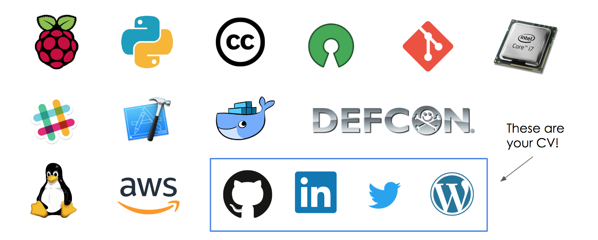

# Generation Z Developers
    
    
    
## MVP table 
MVP Table 

{width=5}

{width=10px }

{width=20pt }

{width=5% }

{width=15% }

| name | what | task | price | image | status | wc  |
|------|------|------|-------|-------|--------| ----|    
| {width=5% }  | {width=15% }  Creative Commons | Copyright License to release content under | Release a blog post or other content under a CC license | zero |  | content | 1479 |
|  | a | b |    
| {width=5% }  | {width=15% }  Open Source |  |  |  |  | draft | 848 |
|  | a | b |    
| {width=5% }  | {width=15% }  MVP for Gen Z Dev |  |  |  |  |  | 215 |
|  | a | b |    
| {width=5% }  | {width=15% }  Docker |  |  |  |  | content | 591 |
|  | a | b |    
| {width=5% }  | {width=15% }  CPU |  |  |  |  | draft | 199 |
|  | a | b |    
| {width=5% }  | {width=15% }  Copyright |  |  |  |  | draft | 61 |
|  | a | b |    
| {width=5% }  | {width=15% }  EFF |  |  |  |  | draft | 50 |
|  | a | b |    
| {width=5% }  | {width=15% }  Free Sofware Foundation |  |  |  |  | draft | 70 |
|  | a | b |    
| {width=5% }  | {width=15% }  Jira | Issue tracking (can be used as Graph Database) | Create an free account at atlassian.com and try it out | 0 to you |  | content | 279 |
|  | a | b |    
| {width=5% }  | {width=15% }  OWASP |  |  |  |  | draft | 90 |
|  | a | b |    
| {width=5% }  | {width=15% }  Python |  |  |  |  | draft | 42 |
|  | a | b |    
| {width=5% }  | {width=15% }  Slack |  |  |  |  | draft | 73 |
|  | a | b |    
| {width=5% }  | {width=15% }  WallabyJS |  |  |  |  | draft | 144 |
|  | a | b |    
| {width=5% }  | {width=15% }  XCode |  |  |  |  | draft | 16 |
|  | a | b |    
| {width=5% }  | {width=15% }  google |  |  |  |  | draft | 65 |
|  | a | b |    
| {width=5% }  | {width=15% }  linux |  |  |  |  | draft | 98 |
|  | a | b |    
| {width=5% }  | {width=15% }  raspberry-pi |  |  |  |  | draft | 53 |
|  | a | b |
 
        
    
    
    
    
    
    
    
    
    
    
    
    
    
    
    
    
    
    
    
    
    
    
    
    
    
    
    
    
    
    
    
    
    
    
    
    
    
    
    
    
    
    
    
    
    
    
    
    
    
    
    
    
    
    
    
    
    
    
    
    
    
    
    
    
    
    
    
    
    
    
    
    
    
    
    
    
    
    
    
    
    
    
    
    
    
    
    
    
    
    
    
    
    
    
    
    
    
    
    
    
    
    
    
    
    
    
    
    
    
    
    
    
    
    